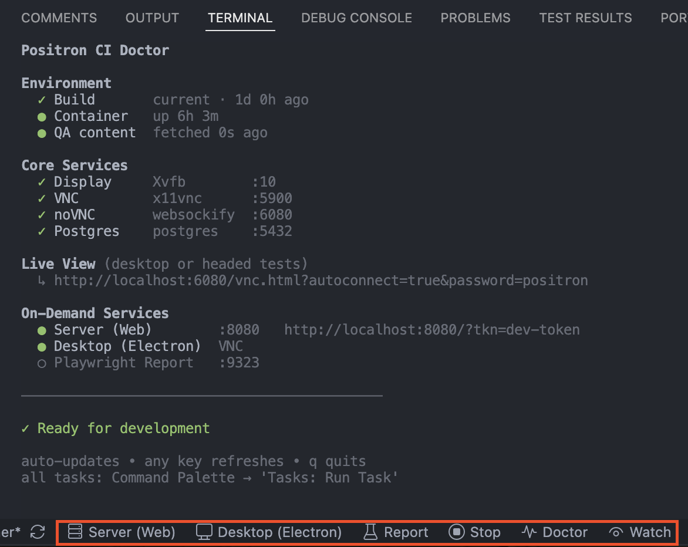
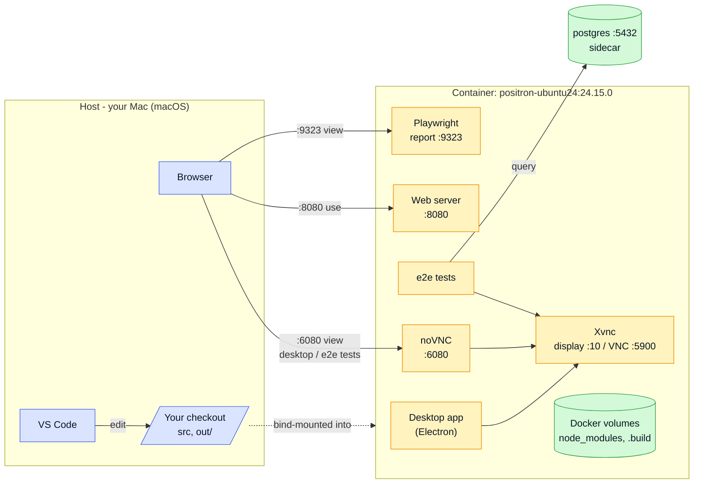

# Positron CI dev container (ubuntu24-arm64)

Develop, debug, and run Positron **inside the actual CI image**
(`ghcr.io/posit-dev/positron-ubuntu24:24.15.0`) so CI failures reproduce locally. You edit code in VS Code on your host; the build, tests, and Positron itself run in the container.

> Validated on **arm64** (Apple Silicon) only. The base image is a multi-arch
> manifest, so Docker resolves the host arch automatically; `POSITRON_CI_IMAGE_ARCH`
> now only selects the in-container Electron build arch. amd64 hosts should work but
> aren't validated yet. Host: macOS with Docker Desktop + VirtioFS. Linux and
> Windows/WSL2 aren't validated yet.

<p align="center">
  
</p>

## Prerequisites

One-time setup:

1. Install and configure **Docker Desktop**, in `Settings`:
    * **Resources -> Advanced**: **8+ CPU**, **12 GB RAM**, a few GB free disk.
    * **General -> Virtual Machine Options**: turn on **VirtioFS**.
2. **GHCR login** (images are private):

   ```bash
   docker login ghcr.io -u <your_github_username>   # password = a GitHub PAT with read:packages
   ```

3. Install the **[Dev Containers](https://vscode.dev/redirect?url=vscode%3Aextension%2Fms-vscode-remote.remote-containers)**
   extension in **VS Code** (click the link to open straight to its install page) - it's what opens
   the container. The lab's own extensions (Task Buttons, Playwright, etc) install automatically
   inside the container.

## Setup

Do this once per machine -- the lab worktree is meant to be long-lived. Check `git worktree list`
first; if one already exists, reuse it ([User Workflows](#user-workflows-vs-code-ui) covers reopening)
instead of creating a second one, which silently shares rather than isolates build state with the
first (see the [Gotchas](#gotchas) entry on this).

### 1. Create the worktree

Create a dedicated git worktree for your CI lab so Linux build artifacts never mix with native builds (see [Don't mix container and native builds](#dont-mix-container-and-native-builds)). Start from a full Positron clone (not a shallow clone) because the build requires git history:

```bash
git worktree add ../positron-ci-lab
```

### 2. Add secrets - in the new worktree

These files are gitignored, so they aren't copied into the worktree. The container needs both:

* **.env** - first copy the example env file:

    ```
    cp .devcontainer/ci-arm/.env.example .devcontainer/ci-arm/.env
    ```

    Then insert the `E2E Postgres DB connection info` from 1Password.

* **license.txt** - the `Positron Server private key` from 1Password -> `.devcontainer/ci-arm/license.txt`.

### 3. Open it in the container

In VS Code, open the Command Palette and run **`Dev Containers: Open Workspace in Container...`**.
A file picker opens - select **`positron-ci-lab.code-workspace`** from the worktree directory.
A quick pick then appears - choose **`Positron CI (ubuntu24-arm64)`**.
The first open runs the ~10-min cold build; later opens are fast.

**After the first build, run `Developer: Reload Window` once** so the editor's TypeScript server and
Playwright extension pick up the freshly installed `node_modules` (one-time; later opens are clean).
Then open the **Doctor** (status-bar button) to confirm everything's up.

That's it - you have a working CI lab.

## Workflows

Two audiences, two subsections below: a human driving VS Code's Dev Containers UI, or an agent (e.g.
Claude Code) driving the same stack headlessly over `docker compose` / `docker exec`. Both need
[Setup](#setup) done first.

### User Workflows (VS Code UI)

| To... | Do this |
|---|---|
| reopen the lab | **Open Recent** the worktree, then **Reopen in Container** |
| done for the day | click **Stop** (stops services, prints disconnect instructions), then click the remote indicator → **Reopen Folder Locally** |
| return to local VS Code | run **Dev Containers: Reopen Folder Locally** |
| find where the lab lives | `git worktree list` prints its path (it's a directory, not a branch - `cd` into it) |
| run a common action | click a **Task Button** in the status bar |
| run any task | `Cmd-Shift-P` -> **Tasks: Run Task**, filter "Positron CI" |
| debug Positron's source | open **Run and Debug** (`Cmd-Shift-D`), pick a **Positron CI:** profile |

> [!IMPORTANT]
> Keep the **Doctor** open: a live dashboard of build/service status, ports, and URLs. If a check
> fails, it tells you which task fixes it.

#### Editing and the Watch task

The **Watch** task incrementally recompiles `src/` to `out/` on save. Start it when you're editing
Positron's source; you don't need it to run or test the existing build. Dependency changes (for example, a new package-lock.json) require Reinstall deps (or Reinstall e2e deps) or Rebuild instead; the **Doctor** flags this.

#### Run Positron itself
Click these task buttons to run Positron:
* **Server (Web)** - a licensed server at `http://localhost:8080/?tkn=dev-token` (browser).
* **Desktop (Electron)** - the desktop app on the headless display; view via VNC.

Both run detached and restart cleanly on re-click; their URLs show in the Doctor. Click **Logs** to
tail their output (`/tmp/positron-{server,electron}.log`, inside the container). **Stop** shuts both
down (and the report), leaving core services up.

#### Run tests

Click the run icon in the gutter on any spec (if it's missing, check the selected Playwright project), or
from the terminal: `npx playwright test --project e2e-electron --grep @:search`.

Headed runs (`e2e-electron` and `e2e-chromium`) render on the headless display. Open the noVNC link in the **Doctor** to view it live. Use the **Report** task to serve the report at any time.

#### Test data (test-files)

The e2e tests open files from `test/e2e/test-files` in the repo; the framework copies them into the
test workspace on first run. To grab them up front for manual repro, run **Positron CI: Get QA
content** - it's symlinked at `~/test-files`.

#### Debug

To debug **Positron's own source**, open the **Run and Debug** panel (`Cmd-Shift-D`), pick a profile,
and run it. Set breakpoints in `src/` as usual; both run on the headless display, so view in VNC.

* **Positron CI: Debug (Electron)** - the desktop app; attaches to all its processes (main, renderer,
  extension host, ...). Simplest for most source.
* **Positron CI: Debug (Web)** - the browser build; brings up the licensed server (`:8080`) and debugs
  the workbench frontend in Chromium. For web-only or `e2e-chromium` behavior.

Debug **e2e tests** straight from the test files via the gutter run/debug icons, not a launch profile.

### Claude Workflows (CLI-only, headless)

Everything in [User Workflows](#user-workflows-vs-code-ui) assumes VS Code's Dev Containers UI. An
agent (or any terminal-only workflow) can drive the same stack directly with `docker compose` +
`docker exec`, once [Setup](#setup)'s steps 1-2 are done (worktree created, secrets added) -- the
build itself can happen through this path too, no Dev Containers UI required.

1. **Set the workspace env vars** (normally run by the `initializeCommand` hook):

   ```bash
   cd <worktree>/.devcontainer/ci-arm
   ./initialize.sh   # writes POSITRON_WORKSPACE_PATH / POSITRON_GIT_COMMON_DIR into .env
   ```

2. **Point the worktree at the target branch** (skip this on a fresh worktree; it matters once the lab
   is long-lived and reused across sessions). Don't assume the checked-out source matches whatever
   you're currently investigating -- fetch and check out explicitly:

   ```bash
   cd <worktree>
   git fetch origin <branch>
   git checkout <branch>
   ```

   Switching branches can leave two things stale, both of which the Doctor's Build row already checks:

   - **Dependencies.** Compare `package-lock.json`'s hash against the one recorded at the last install:

     ```bash
     docker compose exec test bash -lc \
       "cd \$POSITRON_WORKSPACE_PATH && [ \"\$(sha256sum package-lock.json | awk '{print \$1}')\" = \"\$(cat .build/.ci-arm-state/deps.sha 2>/dev/null)\" ] && echo OK || echo DRIFTED"
     ```

     A `DRIFTED` result means reinstall, via the same `reinstall-deps.sh` script the **Positron CI:
     Reinstall deps** task calls:

     ```bash
     docker compose exec test bash -lc \
       "cd \$POSITRON_WORKSPACE_PATH && ./.devcontainer/ci-arm/reinstall-deps.sh root"
     ```

     Repeat with `e2e` instead of `root` (**Positron CI: Reinstall e2e deps**) against
     `test/e2e/package-lock.json` / `e2e-deps.sha` if the target branch also touched e2e's own deps.

   - **Compiled output.** `out/` is bind-mounted and reflects whichever branch was last built here, so
     recompile after switching:

     ```bash
     docker compose exec -d test bash -lc \
       "cd \$POSITRON_WORKSPACE_PATH && npm exec -- npm-run-all --max_old_space_size=4095 -lp compile > /tmp/compile.log 2>&1"
     ```

     This is incremental -- the same thing the **Watch** task does -- so it's much faster than the
     first-time build in step 5 below.

3. **Bring up the stack.** `initialize.sh` (step 1) pins `COMPOSE_PROJECT_NAME` to this checkout's own
   directory name, so its containers/volumes never collide with another checkout's -- the remaining
   steps use `docker compose exec <service>` instead of a hardcoded container name, so they resolve
   correctly regardless of what that project name is:

   ```bash
   docker compose up -d
   ```

4. **Check whether the build is cold, warm, or hot** before doing anything else -- don't assume:

   ```bash
   docker compose exec test bash -lc \
     "test -f \$POSITRON_WORKSPACE_PATH/.build/.ci-arm-state/complete && echo WARM_OR_HOT || echo COLD"
   ```

   - **COLD** (fresh worktree, or after `reset.sh`): no `node_modules`/`.build` yet -> run the
     first-time build (step 5) before anything else.
   - **WARM** (built before, containers just recreated by step 3): skip straight to step 6.
   - **HOT** (containers were already running, e.g. from an earlier session): skip both step 5 and 6's
     `post-start.sh` call and go straight to step 7.

   If step 7 fails with a `Cannot find module` or missing `out/main.js` error despite a "warm"
   reading, treat it as effectively cold: rerun step 2's dependency-drift check and compile command,
   or fall back to step 5.

5. **First-time build only.** This mirrors `post-create.sh`'s dep install / compile / Electron build /
   Playwright install / license setup -- the same script Dev Containers runs, just invoked directly.
   It takes roughly 10 minutes and is not something to block a foreground shell on:

   ```bash
   docker compose exec -d test bash -lc \
     "cd \$POSITRON_WORKSPACE_PATH && ./.devcontainer/ci-arm/post-create.sh > /tmp/post-create.log 2>&1"
   ```

   `-d` detaches immediately, so this returns right away instead of holding the shell for
   10 minutes. Poll for completion instead of guessing at a fixed sleep -- check every minute or two,
   not continuously, and read the log on failure:

   ```bash
   docker compose exec test bash -lc \
     "test -f \$POSITRON_WORKSPACE_PATH/.build/.ci-arm-state/complete && echo DONE || tail -5 /tmp/post-create.log"
   ```

   The marker file (`.build/.ci-arm-state/complete`, written by `mark-build-state.sh`) is the same
   completion signal step 4 checks -- once it's there, move on to step 6.

6. **Per-start setup** (display, VNC, postgres reachability -- idempotent, safe to always run except
   on an already-HOT container):

   ```bash
   docker compose exec test bash -lc "cd \$POSITRON_WORKSPACE_PATH && ./.devcontainer/ci-arm/post-start.sh"
   ```

7. **Run a test directly**, e.g. a single e2e spec:

   ```bash
   docker compose exec -e DISPLAY=:10 test bash -lc \
     "cd \$POSITRON_WORKSPACE_PATH && npx playwright test test/e2e/tests/search/search.test.ts --project e2e-electron"
   ```

   All `docker compose` commands above must run from `<worktree>/.devcontainer/ci-arm` (step 1's
   directory) so Compose finds the right project's `docker-compose.yml` and `.env`.

Gotchas specific to this path:

- **No `containerEnv` injection -- export all four interpreter versions.** Values from
  `devcontainer.json`'s `containerEnv` block are applied by the Dev Containers extension, not by plain
  `docker compose`. The e2e suite's `test/e2e/tests/_test.setup.ts` *throws* unless all four are set,
  so every headless test run must export them explicitly -- not just the one interpreter under test:
  `POSITRON_PY_VER_SEL`, `POSITRON_R_VER_SEL`, `POSITRON_PY_ALT_VER_SEL`, `POSITRON_R_ALT_VER_SEL`.
  Discover the installed versions first (`pyenv versions` for Python; `ls /opt/R` for R), then pass
  each one:

  ```bash
  docker compose exec \
    -e POSITRON_PY_VER_SEL=3.13.0 -e POSITRON_R_VER_SEL=4.5.2 \
    -e POSITRON_PY_ALT_VER_SEL=3.10.12 -e POSITRON_R_ALT_VER_SEL=4.4.2 \
    -e DISPLAY=:10 test bash -lc "cd \$POSITRON_WORKSPACE_PATH && npx playwright test ..."
  ```
- **Don't skip the cold/warm/hot check.** Running `post-create.sh` on an already-built container just
  wastes ~10 minutes (it's idempotent-safe but not idempotent-fast); skipping it on a truly cold
  container fails every later step with confusing missing-module errors instead of one clear one.
- **No `devcontainer` CLI required** -- this is plain `docker compose`, useful since the CLI isn't
  installed by default on the host.
- **Reproducing a CI-only flake? Run the *whole* spec at `--workers=1`.** Positron doesn't split a
  single spec file across workers, so its tests run in order and share app state. A test that only
  fails in CI often passes in isolation (a single `--grep`) yet fails because an earlier test in the
  same file left state behind. Don't conclude "can't reproduce" from the isolated run -- run the
  entire spec file in order before deciding:

  ```bash
  docker compose exec -e DISPLAY=:10 test bash -lc \
    "cd \$POSITRON_WORKSPACE_PATH && npx playwright test test/e2e/tests/<area>/<file>.test.ts --project e2e-electron --workers=1"
  ```

## Reference

### Architecture

You **edit on your host**; **everything else runs in the container.** The desktop is headless - you view it (and any headed test) through noVNC in a browser. A postgres sidecar backs the e2e tests.



Two ways to see Positron: **use** the web server at `:8080` in your browser, or **view** the
headless desktop (including any headed e2e test) over noVNC at `:6080`.

A window manager (fluxbox) keeps windows movable on the display. Forwarded to your host: `:8080`
(server), `:6080` (noVNC desktop), `:9323` (Playwright report), `:5900` (native VNC). The bind mount
vs Docker volume split is covered below.

### How storage works

Your **checkout** is a bind mount, so edits live on your host disk and file navigation works
normally. The heavy **container-built dirs** live on Docker volumes instead: native volume I/O performs much better than macOS bind mounts, and it keeps those big Linux-built dirs off your host disk. There are five, prefixed with the Compose project (e.g. `ci-arm_`; list them with `docker volume ls` or `reset.sh`):

| Volume | Holds |
|---|---|
| `positron-node-modules` | root `node_modules` (the big one) |
| `positron-e2e-node-modules` | `test/e2e/node_modules` (separate npm project; small) |
| `positron-remote-node-modules` | `remote/node_modules` (native server modules: spdlog, kerberos, node-pty) |
| `positron-build` | `.build/` (built Electron + artifacts) |
| `postgres-data` | the postgres sidecar's database files |

`out/` is the exception: it stays on the bind mount, since the compile recreates it.

Everything not listed above - your home dir, `/tmp`, and all logs (Positron's, the Xvnc desktop, the
detached server/desktop) - lives in the container's writable layer: container-only, not on your
host, and wiped on rebuild or `reset.sh`. Grab logs before rebuilding.

Your checkout is a **worktree** (from Setup), so a host-side `initializeCommand` mounts both it and
the shared git dir - that's what lets git resolve normally inside the container.

### Don't mix container and native builds

**One directory, one toolchain.** A few build artifacts (including three OS-specific binaries - `pet`,
`ark`, `kcserver`) live in the source tree, shared between host and container. Building the same checkout both in the container (Linux) and natively (macOS) causes them to overwrite each other, breaking interpreter and kernel startup. The dedicated worktree from [Setup](#setup) prevents this; if you're
already mixed, see [Gotchas](#gotchas) for the fix.

### Tasks

| Task | What it does |
|---|---|
| **Positron CI: Start server** | licenses and serves Positron at `:8080` (detached, clean restart, prints the URL when up) |
| **Positron CI: Desktop** | runs the desktop app on the headless display, view via VNC (detached, clean restart) |
| **Positron CI: VNC** | ensures VNC is up; prints `vnc://localhost:5900` and the password |
| **Positron CI: Report** | serves the last run's trace/report at `:9323` |
| **Positron CI: Logs** | tails the detached server + desktop logs in a terminal |
| **Positron CI: Stop** | stops the on-demand server/desktop/report (leaves Xvnc/noVNC/postgres up) |
| **Positron CI: Doctor** | live dashboard - build status + what's up (Xvnc/noVNC/postgres, server/desktop/report); updates when state changes, any key refreshes, `q` quits |
| **Positron CI: Reinstall deps** | after the root `package-lock.json` changes; records only the root hash |
| **Positron CI: Reinstall e2e deps** | after `test/e2e/package-lock.json` changes; records only the e2e hash |
| **Positron CI: Reinstall interpreters** | restore the Linux `pet`/`ark`/`kcserver` binaries after a native build clobbered them (Python/R fail to start; the Doctor flags it) |
| **Positron CI: Rebuild** | re-runs the whole cold build (idempotent) |
| **Positron CI: Get QA content** | provision test-files for manual repro; linked at `~/test-files` |
| **Positron CI: Watch (src)** | incremental compiler for the edit-debug loop; reload the window after "Finished compilation" |
| *Run and Debug ->* **Positron CI: Debug (Electron)** / **(Web)** | debug Positron source - desktop app / browser build (see Debug above) |

### Start over (reset)

To force a fresh cold build and reset the environment:
1. Close the container (**Dev Containers: Reopen Folder Locally**)
2. Then run on the host:

```bash
npm run ci-lab-reset                   # shows what it'll remove and prompts
# (or call the script directly: ./.devcontainer/ci-arm/reset.sh)
```

It removes this project's dev container, its data volumes (root + e2e + remote `node_modules`,
`.build`, `postgres-data`) and the compiled `out/`, scoped to this checkout's Compose project. Your source,
`.env`, and `license.txt` are left alone. Then **Reopen in Container** for the clean build.

### Gotchas

- **Blank/white VNC window** means a stuck Electron instance. The **Desktop** task auto-clears it
  now, so just re-launch it. If it persists, the build may not be ready (run the Doctor) or check the
  desktop log.
- **`npm ci` may leave files staged in your worktree.** Positron's postinstall runs
  `git add --renormalize`, which stages line-ending changes in your bind-mounted index. It's
  harmless: `git restore --staged .`.
- **Python/R interpreters dead after building one checkout both ways** - wrong-OS `pet`/`ark`/`kcserver`
  (see [Don't mix container and native builds](#dont-mix-container-and-native-builds)). The Doctor's
  **Interpreters** row flags this; run **Positron CI: Reinstall interpreters** to restore the Linux
  binaries.
- **Switching branches:** the source is bind-mounted, so a `git checkout` changes files under any
  running Watch/Positron/debug mid-session. Three ways to switch, cleanest first:
  - **Recommended -- switch before opening.** From local VS Code (**Reopen Folder Locally**),
    `git checkout` the target branch, then **Reopen in Container**. Nothing is running over the
    files as they change.
  - **Mid-session (messier).** `git checkout` in the open container, then reload the window and let
    **Watch** recompile (restart any running Positron/debug). Note Watch recompiles but does *not*
    check dependency drift -- rely on the Doctor's **Build** row to flag stale deps.
  - **Headless.** [Claude Workflows](#claude-workflows-cli-only-headless)'s step 2 does the same
    thing over the CLI, including the dependency-drift check Watch doesn't handle.

  Whichever path you take, keep the **Doctor** open: its Build and Interpreters rows tell you what
  went stale and which task fixes it.
- **Each checkout gets its own containers automatically -- but only once `initialize.sh` has run for
  it.** Compose's project name defaults to the directory *basename* holding `docker-compose.yml`,
  which is `ci-arm` for every checkout of this repo (they all have the same `.devcontainer/ci-arm`
  layout); without a fix, two checkouts would silently share one set of containers and volumes
  instead of erroring. `initialize.sh` (Setup step 3 / CLI-only step 1) closes this by pinning
  `COMPOSE_PROJECT_NAME` to the checkout's own directory name, so `docker compose up -d` always
  creates that checkout's own containers. The one sharp edge: a checkout whose `.env` predates this
  fix (no `COMPOSE_PROJECT_NAME` line) still defaults to the shared `ci-arm` name until
  `initialize.sh` runs again -- which happens automatically on the next **Reopen in Container**, but
  not mid-session. If you ever see a `postCreateCommand`/`postStartCommand` fail with a script "not
  found" despite the file clearly being there, or a build behaving like it belongs to a different
  branch, suspect a stale shared container from another checkout: `docker compose down` from the
  checkout you're trying to use, then bring the stack back up.
- **The Ports panel fills up** (30-40 entries). Positron auto-forwards many internal `127.0.0.1`
  ports (extension hosts, language servers, kernels); only the four labeled ones
  (8080/9323/6080/5900) matter. Run **Remote: Close Unused Ports** to declutter.
- **After editing test-infra files** (`test/e2e/infra/...`), run **Developer: Reload Window** so the
  Playwright extension picks them up (it caches transpiles in a worker).
