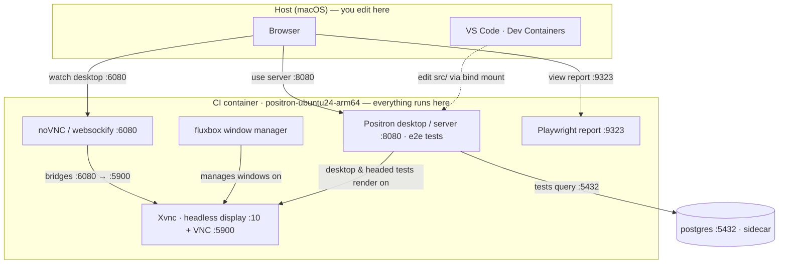

# Positron CI dev container (ubuntu24-arm64)

Develop, debug, and run Positron **inside the actual CI image**
(`ghcr.io/posit-dev/positron-ubuntu24-arm64`) so CI failures reproduce locally. You edit code
natively in VS Code; the build, the tests, and Positron itself all run in the container.

> Validated on **arm64** (Apple Silicon) only. The arch is parameterized
> (`POSITRON_CI_IMAGE_ARCH`), but amd64 isn't usable yet: arm64 and amd64 are tagged independently in
> the CI images, so the single pinned tag only resolves for arm64 until those tags are synced (in
> progress). Hosts: macOS and Linux — Windows/WSL2 isn't validated yet.

<p align="center">
  
</p>

## Prerequisites

Once, on your machine:

1. **Docker Desktop**, in `Settings`:
    * **Resources → Advanced**: **8+ CPU**, **12 GB RAM**, a few GB free disk.
    * **General → Virtual Machine Options**: turn on **VirtioFS**.
2. **GHCR login** (images are private):

   ```bash
   docker login ghcr.io -u <your_github_username>   # password = a GitHub PAT with read:packages
   ```

3. Install the **[Dev Containers](https://marketplace.visualstudio.com/items?itemName=ms-vscode-remote.remote-containers)**
   extension in **VS Code** — it's what opens the container. The lab's own extensions (Task Buttons,
   Playwright, etc) install automatically inside the container.

## Setup

### 1. Create the worktree

Once, to create your Container CI lab: a **dedicated git worktree** so its Linux build artifacts
never mix with native builds (see [Don't mix container and native builds](#dont-mix-container-and-native-builds)).
From your Positron checkout (a **full** clone — the build needs git history, so not a shallow one):

```bash
git worktree add ../positron-ci-lab
```

### 2. Add secrets — in the new worktree

Gitignored, so not copied in; the container needs both env vars:

* **.env** — first copy the example env file:

    ```
    cp .devcontainer/ci-arm/.env.example .devcontainer/ci-arm/.env
    ```

    Then insert the `E2E Postgres DB connection info` from 1Password.

* **license.txt** — the `Positron Server private key` from 1Password → `.devcontainer/ci-arm/license.txt`.

### 3. Open it in the container

In VS Code via Command Palette run:
**`Dev Containers: Open Workspace in Container… > positron-ci-lab.code-workspace > Positron CI (ubuntu24-arm64)`**.
The first open runs the ~10-min cold build; later opens are fast.

**After the first build finishes, run `Developer: Reload Window` once.** The editor attaches while
the cold build is still installing `node_modules`, so the TypeScript server and Playwright extension
start against an empty workspace. The reload restarts them against the now-installed deps. One-time only: later opens already have `node_modules`, so they come up clean. When you see success message, start up the Doctor (task button in status bar) to confirm that everythign is running smoothly.

That's it — you have a working CI lab. :tada:

## Daily use

**Get in and out.** To reopen the lab: **Open Recent** the worktree, then **Reopen in Container**. To return to local VS Code, run **Dev Containers: Reopen Folder Locally**.

**Find the lab again.** It's a separate directory, not a branch — you don't switch to it, you `cd`
into it. Forgot where it lives? `git worktree list` prints every worktree and its path:

```bash
git worktree list          # shows .../positron-ci-lab
cd ../positron-ci-lab      # from your main checkout
```

**Run things.** Common actions are **Task Buttons** in the status bar; everything else is
`Cmd-Shift-P → Tasks: Run Task` (filter "Positron CI"); debug profiles are in **Run and Debug**.

> [!IMPORTANT]
> Keep the **Doctor** open — a live dashboard of build/service status and URLs. When something's off,
> it names the task to run.

### Editing and the Watch task

**You only need Watch if you're editing Positron's `src/`.** The cold build (and **Rebuild**) already
compiled a complete, runnable app — so to *just run or test* it, skip straight to
[Run Positron itself](#run-positron-itself) or [Run tests](#run-tests). Watch's only job is to
recompile *your* edits into `out/` as you save.

When you *are* editing, this recompiles in seconds (never the ~10-min cold build):

1. Start the **Watch** task once — it recompiles changed files on save.
2. Edit code in VS Code (files live on your host disk).
3. Reload the Positron window after **Finished compilation**, then re-run or re-debug.

Only `npm ci`-level changes (a new `package-lock.json`) need a heavier step — and you don't have to
guess: the **Doctor** checks deps + build state and names the task (**Reinstall deps** or **Rebuild**).

### Run tests

Click the ▶ in the gutter on any spec (if it's missing, check the selected Playwright project), or
from the terminal: `npx playwright test --project e2e-electron --grep @:search`.

Headed runs (`e2e-electron`/`e2e-chromium`) render on the headless display — open the noVNC link in
the Doctor to watch live; serve the report anytime with the **Report** task.

### Debug

To debug **Positron's own source**, open the **Run and Debug** panel (`Cmd-Shift-D`), pick a profile,
and hit ▶. Set breakpoints in `src/` as usual; both run on the headless display, so watch in VNC.

* **Positron CI: Debug (Electron)** — the desktop app; attaches to all its processes (main, renderer,
  extension host, …). Simplest for most source.
* **Positron CI: Debug (Web)** — the browser build; brings up the licensed server (`:8080`) and debugs
  the workbench frontend in Chromium. For web-only or `e2e-chromium` behavior.

Debug **e2e tests** straight from the test files via the gutter run/debug icons, not a launch profile.

### Run Positron itself

* **Positron CI: Start server** — a licensed server at `http://localhost:8080/?tkn=dev-token` (browser).
* **Positron CI: Desktop** — the desktop app on the headless display; watch via VNC.

Both run detached (logs in `/tmp/positron-{server,electron}.log`) and restart cleanly on re-click;
their URLs show in the Doctor. **Stop** shuts both down (and the report), leaving core services up.

### Test data (qa-example-content)

The e2e tests open files from [qa-example-content](https://github.com/posit-dev/qa-example-content);
the framework clones it on first run. To grab it up front for manual repro, run **Positron CI: Get QA
content** — it's symlinked at `~/qa-example-content`.

## Reference

### Architecture

You **edit on your host**; **everything else runs in the container.** The desktop is headless — you
watch it (and any headed test) through noVNC in a browser. A postgres sidecar backs the e2e tests.



Ports `:8080` (server), `:6080` (noVNC desktop), `:9323` (report), and `:5900` (native VNC) are
forwarded to your host. What lives on a bind mount vs a Docker volume is covered next.

### How storage works

Your **checkout** is a bind mount, so edits live on your host disk and file navigation works
normally. The heavy **container-built dirs** live on Docker volumes instead: native volume I/O beats
macOS bind mounts, and it keeps those big Linux-built dirs off your host disk. There are five,
prefixed with the Compose project (e.g. `ci-arm_`; list them with `docker volume ls` or `reset.sh`):

| Volume | Holds |
|---|---|
| `positron-node-modules` | root `node_modules` (the big one) |
| `positron-e2e-node-modules` | `test/e2e/node_modules` (separate npm project; small) |
| `positron-remote-node-modules` | `remote/node_modules` (native server modules: spdlog, kerberos, node-pty) |
| `positron-build` | `.build/` (built Electron + artifacts) |
| `postgres-data` | the postgres sidecar's database files |

`out/` is the exception: it stays on the bind mount, since the compile recreates it.

Everything not listed above — your home dir, `/tmp`, and all logs (Positron's, the Xvnc desktop, the
detached server/desktop) — lives in the container's writable layer: container-only, not on your
host, and wiped on rebuild or `reset.sh`. Grab logs before rebuilding.

Your checkout is a **worktree** (from Setup), so a host-side `initializeCommand` mounts both it and
the shared git dir — that's what lets git resolve normally inside the container.

#### Don't mix container and native builds

**One directory, one toolchain.** A few build artifacts (including three OS-specific binaries — `pet`,
`ark`, `kcserver`) live in the source tree, shared between host and container. Building the same
checkout both in-container (Linux) and natively (macOS) makes them overwrite each other and breaks
interpreter/kernel startup. The dedicated worktree from [Setup](#setup) prevents this; if you're
already mixed, see [Gotchas](#gotchas) for the fix.

### Tasks

| Task | What it does |
|---|---|
| **Positron CI: Start server** | licenses and serves Positron at `:8080` (detached, clean restart, prints the URL when up) |
| **Positron CI: Desktop** | runs the desktop app on the headless display, watch via VNC (detached, clean restart) |
| **Positron CI: VNC** | ensures VNC is up; prints `vnc://localhost:5900` and the password |
| **Positron CI: Report** | serves the last run's trace/report at `:9323` |
| **Positron CI: Stop** | stops the on-demand server/desktop/report (leaves Xvnc/noVNC/postgres up) |
| **Positron CI: Doctor** | live dashboard — build status + what's up (Xvnc/noVNC/postgres, server/desktop/report); updates when state changes, any key refreshes, `q` quits |
| **Positron CI: Reinstall deps** | after the root `package-lock.json` changes; records only the root hash |
| **Positron CI: Reinstall e2e deps** | after `test/e2e/package-lock.json` changes; records only the e2e hash |
| **Positron CI: Rebuild** | re-runs the whole cold build (idempotent) |
| **Positron CI: Get QA content** | fetch/refresh qa-example-content (test files) for manual repro; linked at `~/qa-example-content` |
| **Positron CI: Watch (src)** | incremental compiler for the edit-debug loop; reload the window after "Finished compilation" |
| *Run and Debug →* **Positron CI: Debug (Electron)** / **(Web)** | debug Positron source — desktop app / browser build (see Debug above) |

### Start over (reset)

To force a fresh cold build - e.g. to verify the whole flow end to end - close the container
(**Dev Containers: Reopen Folder Locally**), then run on the host:

```bash
npm run ci-lab-reset                   # shows what it'll remove and prompts
npm run ci-lab-reset -- -y             # skip the prompt
# (or call the script directly: ./.devcontainer/ci-arm/reset.sh)
```

It removes this project's dev container, its data volumes (root + e2e `node_modules`, `.build`,
`postgres-data`) and the compiled `out/`, scoped to this checkout's Compose project. Your source,
`.env`, and `license.txt` are left alone. Then **Reopen in Container** for the clean build.

### Gotchas

- **Blank/white VNC window** means a stuck Electron instance. The Launch task auto-clears it now, so
  just re-launch. If it persists, the build may not be ready (run the Doctor) or check the desktop
  log.
- **`npm ci` may leave files staged in your worktree.** Positron's postinstall runs
  `git add --renormalize`, which stages line-ending changes in your bind-mounted index. It's
  harmless: `git restore --staged .`.
- **Python/R interpreters dead after building one checkout both ways** — wrong-OS `pet`/`ark`/`kcserver`
  (see [Don't mix container and native builds](#dont-mix-container-and-native-builds)). Run in the
  context whose binaries are wrong, then recompile:
  ```bash
  file extensions/positron-python/python-env-tools/pet \
       extensions/positron-r/resources/ark/ark \
       extensions/positron-supervisor/resources/kallichore/kcserver   # confirms wrong OS
  rm -f extensions/positron-python/python-env-tools/pet extensions/positron-python/resources/pet/VERSION
  rm -f extensions/positron-r/resources/ark/ark extensions/positron-r/resources/ark/VERSION
  rm -f extensions/positron-supervisor/resources/kallichore/kcserver extensions/positron-supervisor/resources/kallichore/VERSION
  npm --prefix extensions/positron-python run install-pet
  npm --prefix extensions/positron-r run install-kernel
  npm --prefix extensions/positron-supervisor run install-kallichore
  ```
  Deleting the `VERSION` marker is required — the installers skip when it matches. (`out/` is shared
  too; recompile after switching.)
- **Switching branches:** the source is bind-mounted, so a `git checkout` changes files under the
  running Watch/Positron/debug mid-session. Either switch before opening, or after the checkout
  reload the window and let **Watch** recompile (restart any running Positron/debug).
- **One dev container per checkout** at a time.
- **The Ports panel fills up** (30-40 entries). Positron auto-forwards many internal `127.0.0.1`
  ports (extension hosts, language servers, kernels); only the four labeled ones
  (8080/9323/6080/5900) matter. Run **Remote: Close Unused Ports** to declutter.
- **After editing test-infra files** (`test/e2e/infra/…`), run **Developer: Reload Window** so the
  Playwright extension picks them up (it caches transpiles in a worker).
