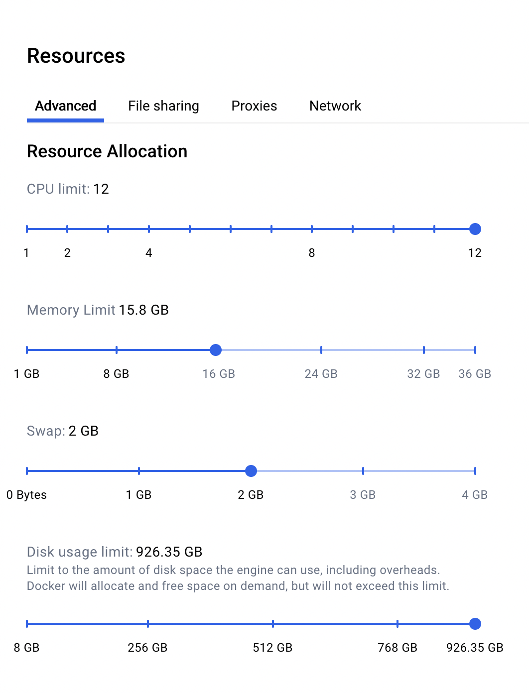

# Setup for Positron ARM64 Local Testing

## Prerequisites

### 1. Create Configuration Files

```bash
cd docker/environments/arm-local
cp .env.example .env
```

Fill in the values from 1Password under `Positron > E2E Postgres DB Connection info`.

### 2. Create License File

Create a `license.txt` file in this directory with the Positron Workbench License from 1Password (IDE/Workbench vault).

### 3. Docker Login

```bash
docker login ghcr.io -u <your_github_username> 
```

Use a GitHub Personal Access Token with `read:packages` scope as your password.

### 4. Docker Resource Settings

In **Docker Desktop → Settings → Resources → Advanced**, allocate enough resources for the test environment to run smoothly. Recommended minimums:

* **CPU**: 8+ cores
* **Memory**: 16 GB
* **Swap**: 2 GB
* **Disk**: enough free space for the container images



## Quick Start

Open **two terminal windows** from the repo root:

### Terminal 1: Start Containers

```bash
npm run arm:start
```

Or for Rocky 8: `npm run arm:start:rocky`

### Terminal 2: Connect & Setup

```bash
npm run arm:connect
```

You'll see a menu with two options regardless of state:

1. **Setup / Update environment** - Clones (first run) or pulls latest and reinstalls (subsequent runs). Prompts for branch.
2. **Skip to shell** - Jump straight to the shell. Use shell commands (see below) to start the server, view reports, etc.

After setup completes, you're ready to run tests:

```bash
# Electron tests (run inside the container)
npx playwright test --project e2e-electron --workers 2 --grep @:connections

# Browser tests against the e2e server (can be run from your local Positron repo)
npx playwright test --project e2e-server --workers 2 --grep @:web
```

## All npm Scripts

```bash
npm run arm:start        # Start containers (ubuntu24)
npm run arm:start:rocky  # Start containers (rocky8)
npm run arm:connect      # Connect to container
npm run arm:stop         # Stop containers
npm run arm:status       # Check status
```

## CI/Automated Usage

```bash
cd docker/environments/arm-local && ./connect.sh --ci main
```

This bypasses prompts and automatically sets up the specified branch.

## Cleanup

1. Terminal 2: `exit`
2. Terminal 1: `Ctrl+C`
3. Optional: `npm run arm:stop`

## View Test Reports

If tests fail, view the report at http://localhost:9323:

```bash
npx playwright show-report --host 0.0.0.0
```

## View Running Tests via VNC

Inside the container, run:

```bash
/tmp/start-vnc.sh
```

Then connect to `localhost:5900` with a VNC viewer (RealVNC Viewer is a good free option).

## Running Positron Manually (no E2E Tests)

Inside the container:

```bash
./scripts/code.sh --no-sandbox
```

Then access via VNC as described above.

## Code Changes and Retesting

Push changes from your local machine, then inside the container:

```bash
git pull
npm run compile
```

If you also changed tests:

```bash
npm --prefix test/e2e run compile
```

If you added dependencies:

```bash
npm run ci
```

## Connecting via SSH

Inside the container, run `/tmp/ssh-install.sh` (if available) or:

**Ubuntu/Debian:**
```bash
apt-get install -y openssh-server
mkdir -p /var/run/sshd
echo 'root:root' | chpasswd
sed -i 's/#PermitRootLogin prohibit-password/PermitRootLogin yes/' /etc/ssh/sshd_config
service ssh restart
```

**Rocky/RHEL:**
```bash
yum install -y openssh-server
mkdir -p /var/run/sshd
echo 'root:root' | chpasswd
sed -i 's/^#\?PermitRootLogin.*/PermitRootLogin yes/' /etc/ssh/sshd_config
sed -i 's/^#\?PasswordAuthentication.*/PasswordAuthentication yes/' /etc/ssh/sshd_config
ssh-keygen -A
/usr/sbin/sshd
```

On your host, add to `~/.ssh/config`:

```
Host docker
  HostName 127.0.0.1
  Port 3456
  User root
  UserKnownHostsFile /tmp/known_hosts
  StrictHostKeyChecking yes
```

Then:

```bash
ssh-keyscan -p 3456 127.0.0.1 >> /tmp/known_hosts
```

Connect from VS Code using the Remote SSH extension. Password is `root`.

## Warnings

The file `test/e2e/fixtures/settings.json` will be updated by test runs. Do not commit this file.
