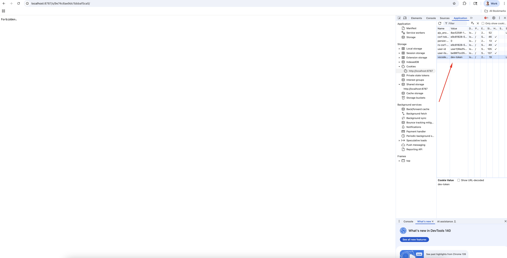

# Setup for Positron Local Workbench Testing

Supports both **arm64** (macOS Apple Silicon) and **amd64** (Windows/x86 Linux). Architecture is auto-detected.

## Prerequisites

### 1. Create Configuration Files

```bash
cd dockerfiles/wb-local
cp .env.example .env
```

Fill in the values:
* **E2E_POSTGRES vars**: 1Password under `Positron > E2E Postgres DB Connection info`
* **WB_PASSWORD**: Your desired password for the `user1` account in Workbench

**Optional overrides** (add to `.env` if needed):
* **ARCH_SUFFIX**: Override auto-detected architecture (`arm64` or `amd64`)
* **IMAGE_TAG**: Override the container image tag (e.g., `100` if the latest tag isn't available for your architecture)

### 2. Docker Login

```bash
docker login ghcr.io -u <your_github_username>
```

> **Note:** When prompted for a password, enter your **GitHub Personal Access Token**, not your GitHub password. The token needs `read:packages` scope.

### 3. Docker Resource Settings

In **Docker Desktop → Settings → Resources → Advanced**, allocate enough resources for Workbench to run smoothly. Recommended minimums:

* **CPU**: 8+ cores
* **Memory**: 16 GB
* **Swap**: 2 GB
* **Disk**: enough free space for the Workbench and Positron images


### 4. GitHub Token

You'll need a GitHub Personal Access Token with `read:packages` scope for downloading Positron releases.

### 5. Shell

* **macOS**: Use the default Terminal
* **Windows**: Use **Git Bash** (comes with Git for Windows)

## Quick Start

Open **two terminal windows** from the repo root:

### Terminal 1: Start Containers

```bash
npm run wb:start
```

### Terminal 2: Connect & Install

```bash
GITHUB_TOKEN=your_token npm run wb:connect
```

You'll see a menu:
1. **Latest versions** - Install latest Workbench + Positron
2. **Specific versions** - Enter custom URLs/tags
3. **Skip to shell** - For reconnecting or manual setup

### Access Workbench

Open http://localhost:8787 and login:
* **Username**: `user1`
* **Password**: Your `.env` WB_PASSWORD value

## Credential Configuration

Workbench can be configured with **one** credential type per install, selected with the
`--credentials` flag:

```bash
GITHUB_TOKEN=your_token npm run wb:connect -- --credentials=databricks
GITHUB_TOKEN=your_token npm run wb:connect -- --credentials=snowflake
GITHUB_TOKEN=your_token npm run wb:connect -- --credentials=azure
```

| Type | Requires in `.env` |
|------|--------------------|
| `databricks` | `DATABRICKS_*` values |
| `snowflake` | `SNOWFLAKE_*` values |
| `azure` | `AZURE_SERVICE_PRINCIPAL_CLIENT_SECRET` |

If `--credentials` is omitted, no data source is configured.

## All npm Scripts

```bash
npm run wb:start     # Start containers
npm run wb:connect   # Connect (requires GITHUB_TOKEN)
npm run wb:stop      # Stop containers
npm run wb:status    # Check status
```

## CI/Automated Usage

```bash
GITHUB_TOKEN=your_token npm run wb:connect -- --ci
```

Or from this directory:
```bash
GITHUB_TOKEN=your_token ./connect.sh --ci
```

This bypasses all prompts and automatically installs the latest versions. Add
`--credentials=<databricks|snowflake|azure>` to configure a data source.

Use `--ci-stable` instead of `--ci` to install the latest Positron with the
released (stable) Workbench:
```bash
GITHUB_TOKEN=your_token ./connect.sh --ci-stable
```

## Cleanup

1. Terminal 2: `exit`
2. Terminal 1: `Ctrl+C`
3. Optional: `npm run wb:stop`

## Troubleshooting

### Getting Forbidden Error

Delete the cookie for vscode-tkn for http://localhost:



Refresh the page and you should be logged in.
