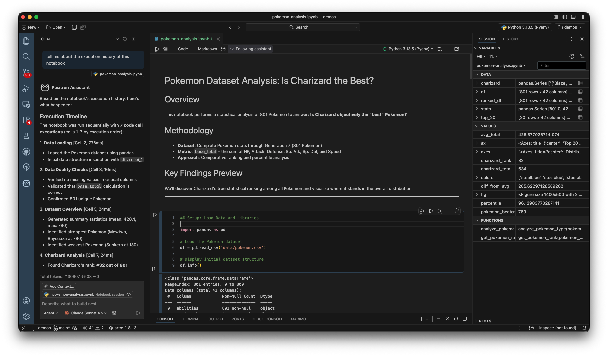

We've built a new Jupyter notebook editor experience to give you a batteries-included experience with:

- **Live variable inspection** - See all your data without print statements
- **Built-in Data Explorer** - Spreadsheet view of any dataframe
- **Context-aware AI** - Assistant that understands your notebook's execution history

Because Positron Notebook is currently in Alpha, there will be some missing functionality. We want to hear your feedback to help us shape what comes next.

To use the Positron Notebook editor, you must explicitly enable it.

#### Steps:
1. Update your settings to enable [Positron Notebook](command:workbench.action.openSettings?positron.notebook.enabled)

2. **Enable Positron Assistant** to leverage AI features. Configure [Positron Assistant](command:workbench.action.openSettings?%5B%22positron.assistant.enable%22%5D) and follow [these instructions](https://positron.posit.co/assistant-getting-started.html#step-2-configure-language-model-providers?utm_source=positron-inapp-walkthrough) to add a model provider of your choice.

3. **Restart Positron** or run the [Developer: Reload Window](command:workbench.action.reloadWindow) command in the Command Palette.

