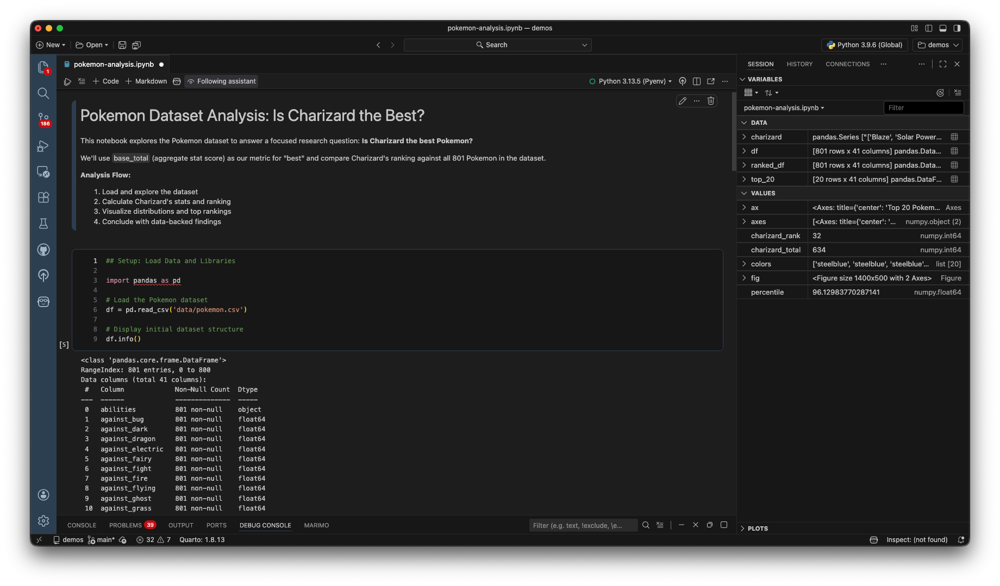
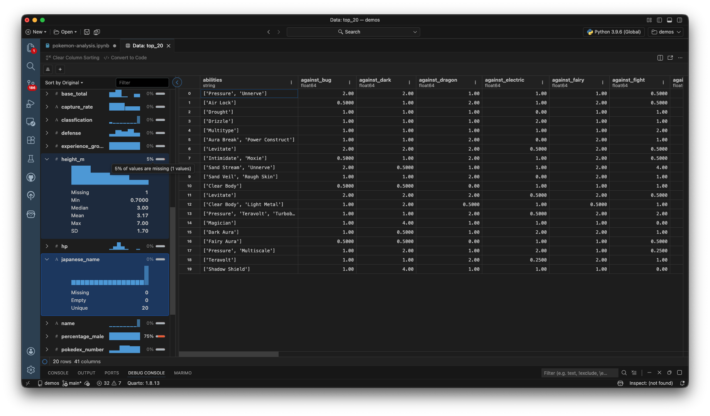
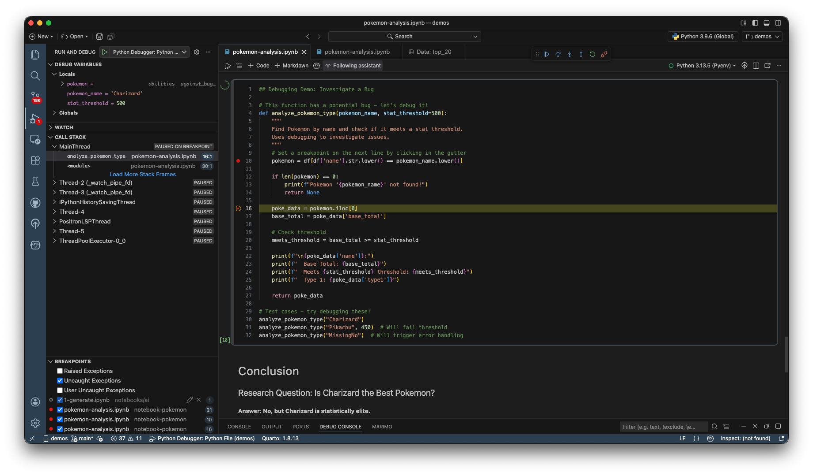

With Positron Notebooks, you have access to multiple tools out of the box to help you interrogate your data.

Give these features a try by exploring them with the [demo notebook](https://github.com/posit-dev/positron-demos-notebooks):

1. **Run all cells**: Click the `Run All` button at the top of the Notebook navigation bar.

2. **Watch the Variables pane**: The [Variables pane](command:positronVariables.focus) on the right will populate automatically, allowing you to inspect and explore dataframes and variables in your current session without needing any print statements.

	Key features of the Variables pane:
	- Automatic population as you run cells
	- View variable types, values, and shapes
	- Inspect dataframes, lists, and dictionaries
	- Sort and filter your variables

3. **Launch the Data Explorer**: Click the `spreadsheet icon` to the right of a dataframe to launch the [Data Explorer](https://positron.posit.co/data-explorer.html?utm_source=positron-inapp-walkthrough).

	In the Data Explorer you can:
	- Sort columns by clicking on column headers
	- Filter data using the filter bar
	- View automatic summary statistics
	- Copy data to clipboard
	- Export filtered results

4. **Use the Debugger**: Set breakpoints and step through your notebook code using the [debugger](https://positron.posit.co/guide-python.html#debugging?utm_source=positron-inapp-walkthrough) to understand execution flow and inspect variables at any point.

