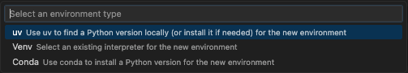

Check your setup by looking at the top right session selector. If you already have an appropriate Python version selected, skip to Explore your data.

#### Select an interpreter:
You can select a specific interpreter for your project by using the [Select Interpreter Session](command:workbench.action.language.runtime.selectSession) command.

This will show you a list of available interpreters, and you can choose the one you want to use. After selecting your interpreter, the current selection will show up in the upper right-hand corner.

#### Need a new environment?
You can create [new Python environments](https://positron.posit.co/python-installations.html#environment-creation-and-discovery) with uv, venv, and conda directly from Positron using the [Python: Create Environment](command:python.createEnvironment) command.

Choose from:
- **uv** - Fast Python package installer and resolver
- **venv** - Python's built-in virtual environment tool
- **conda** - Package, dependency, and environment management

After creating your environment, Positron will automatically detect it and make it available for selection.

