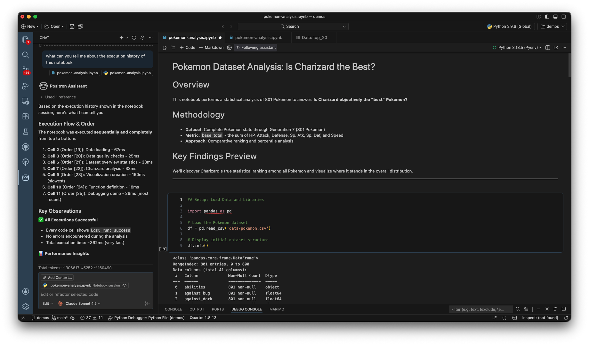

Unlike general purpose AI, Positron Assistant understands which cells you've run and in what order, what variables exist in memory, your execution history and errors.

#### Give it a try:

1. **Run cells**: Run a few cells in the demo notebook to create some variables and outputs.

2. **Partner with Positron Assistant**: [Open Positron Assistant](command:workbench.action.chat.openEditSession) and ask it questions about the notebook.

	Try asking:
	- "What dataframes do I have in memory?"
	- "Tell me about the execution history of this notebook."

	The assistant can see your execution history and variable state, making its suggestions contextually relevant.

3. **Use AI Quick Actions**: In the Positron Notebook navigation bar, click on the [AI assistant button](command:positronNotebook.askAssistant) to explore the prompt gallery of static and dynamic AI quick actions.

