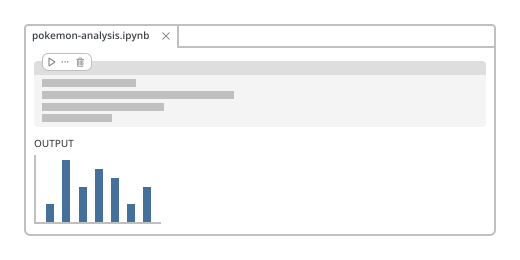

## Get started

* Check out [our documentation on using the Positron Notebook Editor](https://positron.posit.co/positron-notebook-editor), including how to get started with a demo notebook.
* The Positron Notebook Editor is the default for `.ipynb` files. If you previously switched back to the legacy editor, you can [re-enable it in your settings](command:positronNotebookHelpers.walkthrough.enableNotebook).

## Get involved

We believe that the **best tools are built in collaboration with the community**, so we'd love your feedback.

* [Upvote features on our Roadmap](https://github.com/posit-dev/positron/issues?q=is:issue%20state:open%20label:notebooks-roadmap)
* [Chat with us live](https://scheduler.zoom.us/cindy-tong/improving-the-positron-notebook-experience)
* [Request a feature or report a bug](https://github.com/posit-dev/positron/discussions)

Thank you for using the Positron Notebook Editor! Your feedback is invaluable in helping us build great tools for data scientists.

