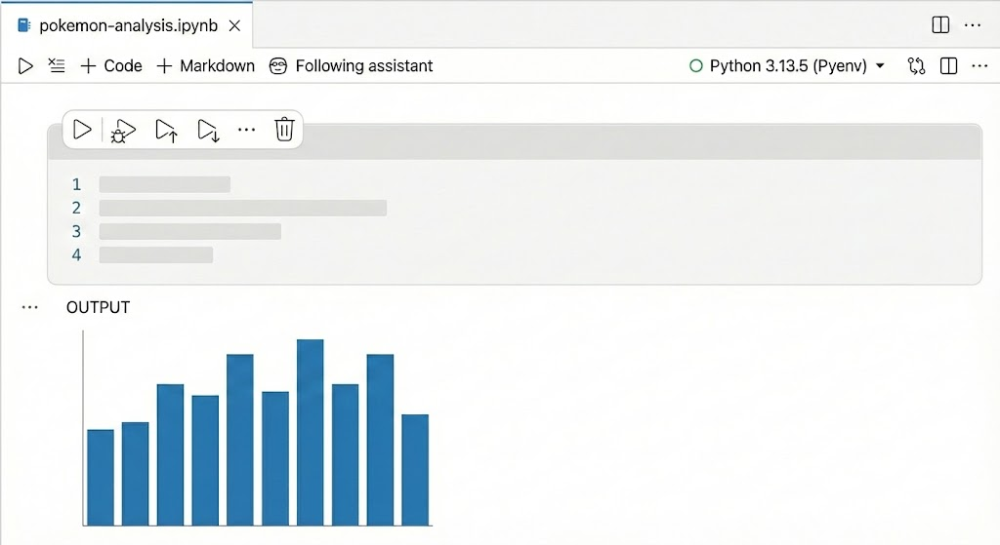

We'd like to invite you to help shape the future of the Positron Notebook editor. Although there are known rough edges with our Alpha release, we are releasing now because we believe that **the best tools are built in collaboration with the community**, and we want your feedback.

## Get involved

* [Upvote features on our Roadmap](https://github.com/posit-dev/positron/issues?q=is:issue%20state:open%20label:notebooks-roadmap)
* [Chat with us live](https://scheduler.zoom.us/cindy-tong/improving-the-positron-notebook-experience)
* [Request a feature](https://github.com/posit-dev/positron/discussions/10047)
* [Report a bug](https://github.com/posit-dev/positron/issues)

Thank you for being an early adopter! Your feedback during this alpha phase is invaluable in helping us build the best notebook experience for data scientists.

**To try out this new experience, update your settings to enable the [Positron Notebook](command:positronNotebookHelpers.walkthrough.enableNotebook) editor.**
