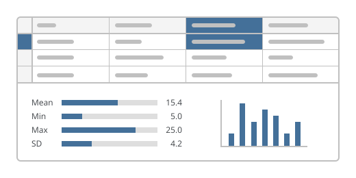

Positron provides a powerful batteries included environment for working with notebooks, with integrated panes designed for data science workflows:

- [Help pane](command:workbench.panel.positronHelp.focus): Lookup documentation for Python objects and packages easily.
- [Connections pane](command:workbench.panel.positronConnections.focus): Manage database connections and preview tables easily.
- [Variables pane](command:positronVariables.focus): inspect and explore variables, dataframes, arrays and objects in your current notebook session.
- [Data Explorer](https://positron.posit.co/data-explorer.html): Click any dataframe in the Variables pane to sort, filter, and explore your data interactively.

**Tip:** Try the [Notebook Layout](workbench.action.positronNotebookLayout) preset, which is optimized for notebook workflows. You can also [customize your layout](command:workbench.action.customizeLayout) to find the arrangement that works best for you.
