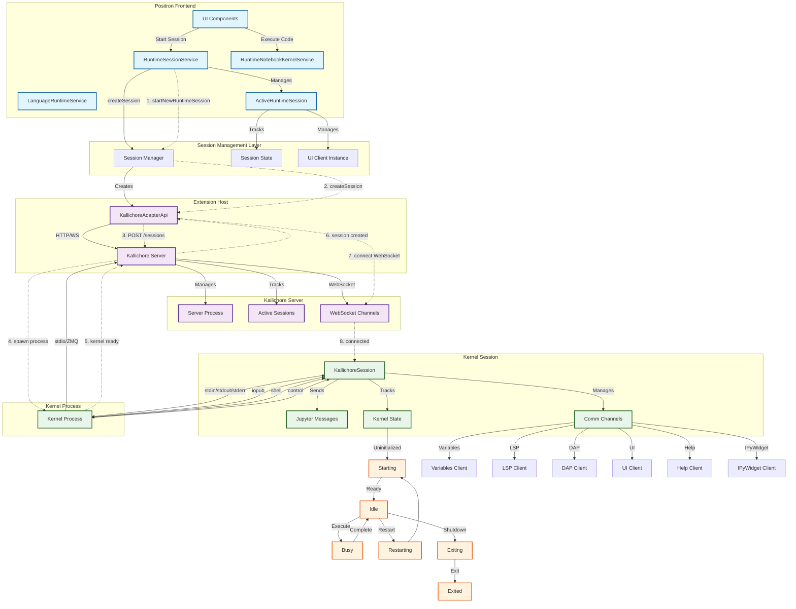
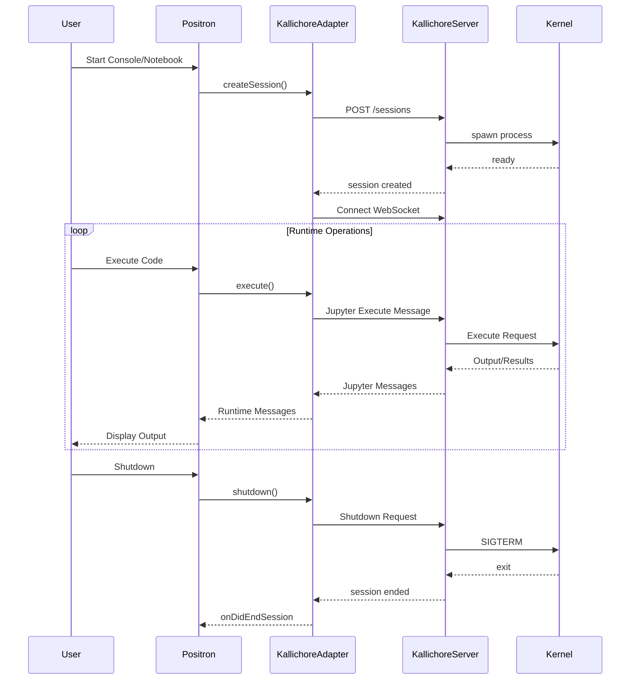
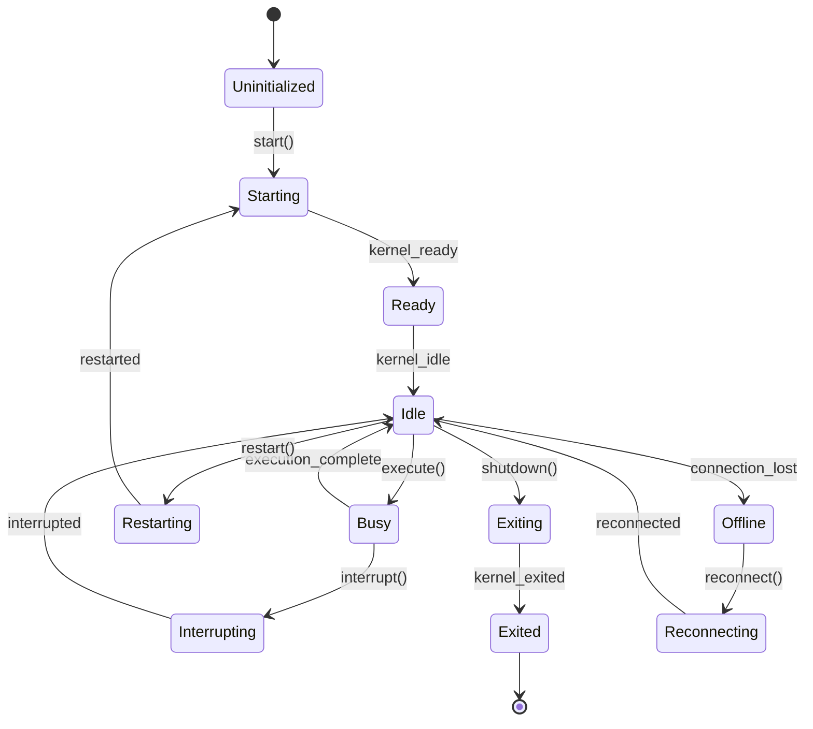

# Positron Kernel Session Management with Kallichore

## Table of Contents
- [Overview](#overview)
- [Architecture](#architecture)
- [Full Lifecycle Walkthrough](#full-lifecycle-walkthrough)
- [Key Components](#key-components)
- [WebSocket Contract](#websocket-contract)
- [Communication Channels](#communication-channels)
- [State Management](#state-management)
- [Session Persistence](#session-persistence)
- [Code Examples](#code-examples)

## Overview

Positron uses Kallichore as its kernel session supervisor to manage language runtime processes (R, Python, etc.). Kallichore provides a robust, scalable system for managing kernel lifecycles with support for persistence, reconnection, and multiple concurrent sessions.

### Key Features
- **Process Isolation**: Kernels run as separate processes managed by Kallichore
- **Session Persistence**: Sessions can survive Positron restarts
- **Multiple Sessions**: Support for multiple console sessions per language and notebook sessions
- **Protocol Compatibility**: Uses Jupyter messaging protocol for kernel communication
- **Language Agnostic**: Supports any Jupyter-compatible kernel

## Architecture



### Architecture Layers

1. **Frontend Layer**: Positron UI and services that manage runtime sessions
2. **Extension Host Layer**: The Kallichore adapter that bridges Positron and the supervisor
3. **Kallichore Server**: A separate process that manages kernel lifecycles
4. **Kernel Processes**: Individual language runtime processes (R, Python, etc.)

## Full Lifecycle Walkthrough



### Detailed Steps

1. **Session Initiation**
   - User triggers session start (console, notebook, or run app)
   - RuntimeSessionService determines session type and manager
   - Session manager creates appropriate runtime session

2. **Kallichore Session Creation**
   - HTTP POST to `/sessions` endpoint with kernel specification
   - Kallichore server spawns kernel process with environment
   - Server waits for kernel to report ready state

3. **WebSocket Connection**
   - Client connects to WebSocket endpoint for session
   - Establishes bi-directional communication channel
   - Registers comm channels for various clients

4. **Code Execution**
   - Code sent via Jupyter execute_request message
   - Kernel processes code and sends results
   - Output streamed back via iopub channel

5. **Session Termination**
   - Shutdown request sent to kernel
   - Kernel gracefully exits
   - Kallichore cleans up resources

## Key Components

### RuntimeSessionService (`IRuntimeSessionService`)
**Location**: `src/vs/workbench/services/runtimeSession/common/runtimeSessionService.ts`

Central service managing all runtime sessions:
- Tracks active sessions, foreground session, starting sessions
- Handles session lifecycle (start, restart, shutdown)
- Maps sessions to notebooks/consoles
- Provides session discovery and selection

### KallichoreAdapterApi
**Location**: `extensions/kallichore/src/KallichoreAdapterApi.ts`

Bridges Positron and Kallichore server:
- Implements language runtime session manager interface
- Handles HTTP/WebSocket communication with server
- Manages session creation and lifecycle
- Translates between Positron and Jupyter protocols

### KallichoreSession
**Location**: `extensions/kallichore/src/KallichoreSession.ts`

Represents individual kernel sessions:
- Manages WebSocket connection to Kallichore server
- Implements Jupyter messaging protocol
- Handles comm channels for various clients
- Tracks kernel state and capabilities

### ActiveRuntimeSession
**Location**: `src/vs/workbench/services/runtimeSession/common/activeRuntimeSession.ts`

Wraps sessions with additional state:
- Manages UI client instance for frontend communication
- Tracks working directory and environment
- Provides session-specific event streams
- Handles session metadata

## WebSocket Contract

### Connection Establishment

```typescript
// WebSocket URL format
ws://<host>:<port>/sessions/<session_id>/channels
```

### Message Format

All messages follow the Jupyter messaging protocol:

```typescript
interface JupyterMessage {
    header: {
        msg_id: string;
        username: string;
        session: string;
        msg_type: string;
        version: string;
        date: string;
    };
    parent_header: object;
    metadata: object;
    content: object;
    channel: 'shell' | 'iopub' | 'stdin' | 'control';
    buffers?: ArrayBuffer[];
}
```

### Message Types

#### Shell Channel (Request/Reply)
- `execute_request` / `execute_reply`: Code execution
- `inspect_request` / `inspect_reply`: Object inspection
- `complete_request` / `complete_reply`: Code completion
- `history_request` / `history_reply`: Command history
- `is_complete_request` / `is_complete_reply`: Code completeness check
- `comm_open` / `comm_close`: Comm channel management
- `kernel_info_request` / `kernel_info_reply`: Kernel capabilities

#### IOPub Channel (Broadcast)
- `stream`: stdout/stderr output
- `display_data`: Rich display output
- `execute_input`: Echoed input
- `execute_result`: Execution results
- `error`: Error information
- `status`: Kernel status updates
- `clear_output`: Clear output directive
- `comm_msg`: Comm channel messages

#### Control Channel
- `shutdown_request`: Kernel shutdown
- `interrupt_request`: Interrupt execution

### Comm Channels

Positron uses Jupyter's comm protocol for specialized communication:

```typescript
// Comm open message
{
    msg_type: 'comm_open',
    content: {
        comm_id: string,
        target_name: string,  // e.g., 'positron.variables', 'positron.lsp'
        data: object
    }
}

// Comm message
{
    msg_type: 'comm_msg',
    content: {
        comm_id: string,
        data: object  // Channel-specific data
    }
}
```

### Positron-Specific Comm Targets

- `positron.variables`: Variable inspection and data viewing
- `positron.lsp`: Language Server Protocol messages
- `positron.dap`: Debug Adapter Protocol messages
- `positron.ui`: UI state synchronization
- `positron.help`: Documentation requests
- `positron.ipywidgets`: IPython widget support
- `positron.plot`: Plot rendering and interaction
- `positron.htmlviewer`: HTML content display
- `positron.dataviewer`: Tabular data viewing

## Communication Channels

### Standard Jupyter Channels

1. **Shell**: Command execution and replies
2. **IOPub**: Broadcast channel for outputs
3. **Stdin**: Input requests from kernel
4. **Control**: High-priority control messages

### Positron Extension Channels

Each comm channel provides specialized functionality:

```typescript
// Variables Client Example
interface VariablesRequest {
    method: 'list' | 'inspect' | 'delete' | 'clear';
    params: {
        path?: string[];
        start?: number;
        limit?: number;
    };
}

// LSP Client Example  
interface LSPRequest {
    method: string;  // LSP method name
    params: object;  // LSP parameters
}
```

## State Management

### Kernel States

```typescript
enum RuntimeState {
    Uninitialized = 'uninitialized',
    Starting = 'starting',
    Ready = 'ready',
    Idle = 'idle',
    Busy = 'busy',
    Interrupting = 'interrupting',
    Restarting = 'restarting',
    Reconnecting = 'reconnecting',
    Exiting = 'exiting',
    Exited = 'exited',
    Offline = 'offline'
}
```

### State Transitions



## Session Persistence

### How It Works

1. **Independent Server Process**: Kallichore runs separately from Positron
2. **Session IDs**: Each session has a unique identifier
3. **Connection Info**: Stored in workspace state
4. **Reconnection**: On startup, Positron attempts to reconnect

### Connection Transports

```typescript
interface ConnectionInfo {
    baseUrl: string;           // HTTP endpoint
    sessionId: string;         // Unique session identifier
    sessionName: string;       // Human-readable name
    transport: 'tcp' | 'ipc';  // Connection type
    // For IPC:
    pipePath?: string;         // Unix socket or named pipe
}
```

### Persistence Benefits

- **Workspace Continuity**: Resume work after IDE restart
- **Long-Running Computations**: Don't lose running calculations
- **Resource Efficiency**: Reuse existing kernel processes
- **Multi-Window Support**: Share sessions across windows

## Code Examples

### Starting a New Session

```typescript
// From RuntimeSessionService
async startNewRuntimeSession(
    runtimeId: string,
    sessionName: string,
    sessionMode: LanguageRuntimeSessionMode,
    notebookUri?: URI
): Promise<ILanguageRuntimeSession> {
    // Find appropriate session manager
    const manager = this._sessionManagers.get(runtimeId);
    
    // Create session through manager
    const session = await manager.createSession(
        runtimeId,
        sessionName,
        sessionMode,
        notebookUri
    );
    
    // Track in service
    this._activeSessionsBySessionId.set(session.sessionId, session);
    
    return session;
}
```

### Executing Code

```typescript
// From KallichoreSession
async execute(code: string, id: string): Promise<void> {
    const msg = createExecuteRequest(code, { id });
    await this.sendShellMessage(msg);
}

// Message creation
function createExecuteRequest(code: string, metadata: any) {
    return {
        header: {
            msg_id: generateId(),
            msg_type: 'execute_request',
            // ... other header fields
        },
        content: {
            code,
            silent: false,
            store_history: true,
            user_expressions: {},
            allow_stdin: true
        },
        metadata
    };
}
```

### Handling Comm Messages

```typescript
// From KallichoreSession
private handleCommOpen(msg: JupyterMessage) {
    const { comm_id, target_name } = msg.content;
    
    // Create appropriate client based on target
    switch (target_name) {
        case 'positron.variables':
            this._variablesClient = new VariablesClient(comm_id, this);
            break;
        case 'positron.lsp':
            this._lspClient = new LSPClient(comm_id, this);
            break;
        // ... other clients
    }
}
```

## Best Practices

1. **Session Management**
   - Always check for existing sessions before creating new ones
   - Handle reconnection failures gracefully
   - Clean up sessions on window/workspace close

2. **Error Handling**
   - Implement timeouts for kernel operations
   - Provide clear error messages for connection failures
   - Allow manual reconnection attempts

3. **Performance**
   - Batch operations when possible
   - Use streaming for large outputs
   - Implement proper backpressure handling

4. **Security**
   - Validate all input before sending to kernel
   - Sanitize output before display
   - Use secure transport when available

## Troubleshooting

### Common Issues

1. **Kernel Won't Start**
   - Check Kallichore server is running
   - Verify kernel specifications are correct
   - Check for port conflicts

2. **Lost Connection**
   - Session may have timed out
   - Network interruption
   - Kallichore server restart

3. **Performance Issues**
   - Too many active sessions
   - Large data transfers
   - Inefficient comm usage

### Debug Tips

- Enable Kallichore debug logging
- Monitor WebSocket traffic in browser tools
- Check kernel process logs
- Use runtime session service diagnostics

## References

- [Jupyter Messaging Protocol](https://jupyter-client.readthedocs.io/en/stable/messaging.html)
- [Kallichore GitHub Repository](https://github.com/posit-dev/kallichore)
- Positron Source: `src/vs/workbench/services/runtimeSession/`
- Kallichore Extension: `extensions/kallichore/`