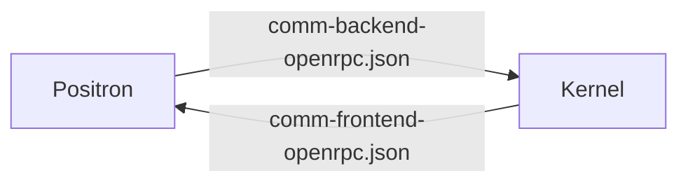

## Positron Comm Contracts

This directory contains the [OpenRPC](https://open-rpc.org/) contracts for most of Positron's custom comm channels. The RPCs that pass through these channels are delivered as [Jupyter Custom messsages](https://jupyter-client.readthedocs.io/en/stable/messaging.html#custom-messages).

OpenRPC is designed for straightforward client-server communication, but Positron's comms are bidirectional. For this reason, each comm has a _pair_ of OpenRPC specifications: one defining the comm's **backend** (implemented by the kernel) and one defining the **frontend** (implemented by Positron)



### Structure

Each Positron comm is defined using three files:

#### Comm Metadata: {comm}.json

This file contains metadata about the comm itself rather than the messages delivered on the comm. There are only 3 metadata fields:

| field          | value                                                                                            |
| -------------- | ------------------------------------------------------------------------------------------------ |
| `name`         | The name of the comm                                                                             |
| `initiator`    | Either `frontend` or `backend`; indicates who opens the comm                                     |
| `initial_data` | A JSON Schema defining the initial data that is expected to be delivered when the comm is opened |

#### Comm Backend: {comm}-backend-openrpc.json

This file contains the interface exposed by the comm's **backend** (kernel). This consists mostly (but not exclusively) of RPC requests and responses.

#### Comm Frontend: {comm}-frontend-openrpc.json

This file contains the interface exposed by the comm's **frontend** (UI).

Because most messages sent to the frontend are events, many methods defined by the frontend contracts do not have a response or reply type. These are [JSON-RPC Notifications](https://www.jsonrpc.org/specification#notification).

## OpenRPC/JSON-RPC Deviations

JSON-RPC is useful as a standardized specification format, but because we are using it in a slightly off-label way, we've made a few tweaks to suit our use case.

- **The "id" field is not used**. Because the JSON-RPC messages are being delivered as `comm_msg` Jupyter messages, each message already has an ID and a parent ID. This makes the JSON-RPC ID redundant.
- **The "jsonrpc" field is optional**.
- **Parameters are always passed by name**. JSON-RPC allows parameters to be passed either positionally (in a JSON array) or by name (in a JSON object). Currently, we only pass arguments by name.

## Making Changes

If you're making changes to these contracts, you will need to coordinate your change across three different repositories. Here's how to do it:

### Step 1: Set Up Repositories

The code generator presumes that you have the `amalthea` repository set up as a sibling folder to `positron`. If you haven't already, clone `amalthea` alongside Positron.

The code generator also places files in `extensions/positron-python`. Prepare the `positron-python` submodule folder for changes by discarding local changes that might conflict and syncing the submodule to `main`.

### Step 2: Change the Contract

Make your desired changes in the JSON files that define the contract.

### Step 3: Run Code Generator

If you haven't already, move to this folder (`comms`) and install the dependencies.

```bash
cd positron/comms
npm install
```

If you've already installed dependencies, just run the code generator.

```
npx ts-node generate-comms.ts
```

This will print all the generated code to the console for inspection. It will also write Rust, Python, and Typescript modules using the new contract.

### Step 4: Test Changes

Build `ark`, restart Positron, and thoroughly test your changes against both R and Python kernels.

### Step 5: Prepare Branches

Create new branches in all three repositories (`positron`, `positron-python`, and `amalthea`). Commit your changes to each branch.

### Step 6: Merge

Once PRs have been approved on each branch, coordinate a merge of all three branches together. A convenient way to do this is to include the submodule bump (`positron-python`) and ark version bump (`amalthea`) as changes in your `positron` PR, so that all the changes land in Positron at the same time.
