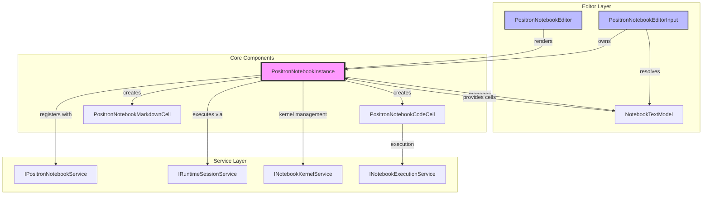
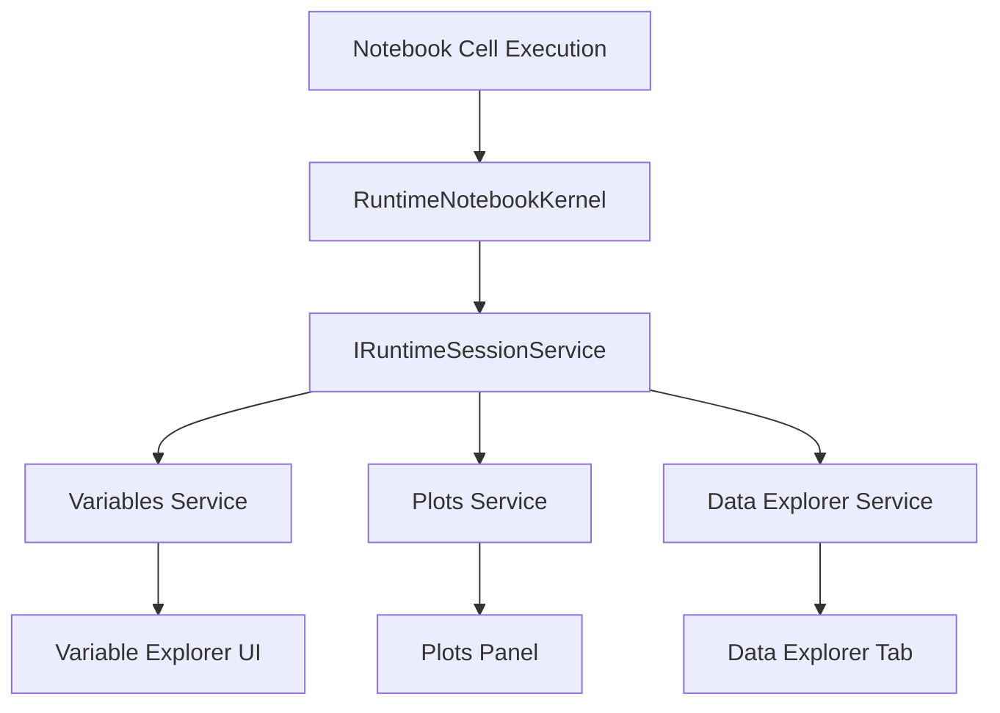

# Positron Notebooks: Implementation Architecture

## Table of Contents

1. [Executive Summary](#executive-summary)
2. [Quick Start for Contributors](#quick-start-for-contributors)
3. [Practical Development Guides](#practical-development-guides)
4. [Architecture Overview](#architecture-overview)
5. [System Components](#system-components)
6. [Accessibility Implementation](#accessibility-implementation)
7. [Kernel Protocol and Integration](#kernel-protocol-and-integration)
8. [Positron Service Integrations](#positron-service-integrations)
9. [Testing and Debugging](#testing-and-debugging)
10. [Performance Optimization](#performance-optimization)
11. [File Organization](#file-organization)
12. [Current Status and Considerations](#current-status-and-considerations)

## Executive Summary

Positron Notebooks represents a parallel notebook implementation within Positron. The implementation coexists with VS Code's standard notebook editor, allowing users to switch between the two experiences using the "Open With..." menu or by changing their default preference.

### Quick Start for Contributors

**To enable Positron Notebooks:**
1. Set `"workbench.editorAssociations": {"*.ipynb": "workbench.editor.positronNotebook"}` in your settings
2. Open any `.ipynb` file - it will use Positron's notebook editor
3. To switch back: Remove the editor association or use "Open With..." menu

**Key files to understand:**
- `positronNotebook.contribution.ts`: Entry point, editor registration, keybindings
- `PositronNotebookEditorInput.ts`: Integrates with VS Code's editor system
- `PositronNotebookInstance.ts`: Core state management and business logic
- `PositronNotebookEditor.tsx`: React-based UI implementation

## Development Guides

### Common Development Tasks

#### Adding a New Cell Type
1. Create interface in `IPositronNotebookCell.ts`
2. Implement base class extending `PositronNotebookCell`
3. Add React component in `notebookCells/`
4. Register in cell factory pattern
5. Update selection machine if needed

#### Modifying Cell Execution
- **Entry Point**: `PositronNotebookInstance.ts`
- **Kernel Integration**: `RuntimeNotebookKernel.ts` for execution routing
- **State Updates**: Use observable pattern for UI synchronization

#### Adding New Configuration Options
1. Use VS Code's standard `workbench.editorAssociations` setting
2. No custom configuration options are needed for editor selection
3. Consider using VS Code's standard configuration patterns for any feature-specific settings

### Development Workflows

#### Local Development Setup
```bash
# Enable Positron notebooks
"workbench.editorAssociations": {"*.ipynb": "workbench.editor.positronNotebook"}

# Key files to modify:
- PositronNotebookInstance.ts    # Core state management
- PositronNotebookEditor.tsx     # UI implementation
- Cell implementation files      # Cell-specific logic
```

#### Debugging Cell Execution Issues
1. Check `kernelStatus` observable in `PositronNotebookInstance`
2. Verify runtime session connection via `IRuntimeSessionService`
3. Use browser dev tools for React component issues
4. Check VS Code's output panel for service-level errors

## Architecture Overview

### Core Design Principles

1. **Editor Resolver Integration**: Uses VS Code's standard `IEditorResolverService` for clean editor selection
2. **Configuration-Driven Default**: Users choose their preferred default editor (positron/vscode) via settings
3. **Parallel Implementation**: Coexists with standard VS Code notebooks without interference
4. **React-Based UI**: Modern component architecture for enhanced user experience
5. **Observable State Management**: Reactive architecture using observables for real-time updates
6. **Service Integration**: Leverages existing VS Code notebook infrastructure where possible

## System Components

### 1. Configuration Layer

**Configuration System**: Positron notebooks use VS Code's standard editor association system.

**Editor Selection**:
- Uses VS Code's standard `workbench.editorAssociations` setting
- Set `"*.ipynb": "workbench.editor.positronNotebook"` to use Positron notebooks as default
- Remove or don't set the association to use VS Code's standard notebook editor
- Located in user or workspace settings.json file


### 2. Editor Registration and Resolution

**Location**: `src/vs/workbench/contrib/positronNotebook/browser/positronNotebook.contribution.ts`

The system uses VS Code's `IEditorResolverService` to register the Positron notebook editor:

```typescript
editorResolverService.registerEditor(
    '*.ipynb',
    {
        id: PositronNotebookEditor.ID,
        label: localize('positronNotebook', "Positron Notebook"),
        priority: RegisteredEditorPriority.option // Always available in "Open With..." menu
    },
    {
        singlePerResource: true,
        canSupportResource: (resource: URI) => resource.scheme === Schemas.file
    },
    {
        createEditorInput: async ({ resource, options }) => {
            const editorInput = PositronNotebookEditorInput.getOrCreate(...);
            return { editor: editorInput, options };
        }
    }
);
```

**Priority Management**:
- Fixed priority: `RegisteredEditorPriority.option` (always available in "Open With..." menu)
- No dynamic priority switching based on configuration
- Users control default editor through `workbench.editorAssociations` setting

**What this means**: Users explicitly opt-in to Positron notebooks through VS Code's standard editor association mechanism. The default experience remains VS Code's standard notebook editor, ensuring no disruption for existing users.

### 3. Core Architecture Components

#### Component Relationship Diagram



### 3. Core Architecture Components

#### A. PositronNotebookEditorInput
**File**: `src/vs/workbench/contrib/positronNotebook/browser/PositronNotebookEditorInput.ts`
**Role**: VS Code EditorInput implementation

**Key Responsibilities**:
- Notebook model resolution and lifecycle management
- Save/revert operations
- Integration with VS Code's editor input system
- Creates and manages `PositronNotebookInstance`

**Key Properties**:
```typescript
static readonly ID: string = 'workbench.input.positronNotebook';
static readonly EditorID: string = 'workbench.editor.positronNotebook';
notebookInstance: PositronNotebookInstance | undefined;
```

**Static Factory Method**:
```typescript
static getOrCreate(
    instantiationService: IInstantiationService,
    resource: URI,
    preferredResource: URI | undefined,
    options: PositronNotebookEditorInputOptions = {}
)
```

#### B. PositronNotebookInstance
**File**: `src/vs/workbench/contrib/positronNotebook/browser/PositronNotebookInstance.ts`
**Role**: Core state manager and execution coordinator

**Key Responsibilities**:
- Notebook cell state management
- Kernel connectivity and execution
- Selection state management
- Bridge between UI and notebook model

**Architecture Features**:
- **Singleton Pattern**: `_instanceMap` for instance management (line 59)
- **Observable Properties**: Reactive state using observables
- **Cell Management**: CRUD operations for notebook cells
- **Selection State Machine**: Advanced selection handling

**Key Observable Properties**:
- `cells`: Observable array of notebook cells
- `selectedCells`: Current cell selection state
- `kernelStatus`: Kernel connection and execution state
- `notebookUri`: Associated notebook file URI

#### C. PositronNotebookEditor
**File**: `src/vs/workbench/contrib/positronNotebook/browser/PositronNotebookEditor.tsx`
**Role**: React-based editor pane implementation

**Key Features**:
- Extends VS Code's `EditorPane`
- React component rendering via `PositronReactRenderer`
- Service injection through React context providers
- Layout management and view state persistence

**Component Hierarchy**:
```typescript
<NotebookVisibilityProvider isVisible={this._isVisible}>
  <NotebookInstanceProvider instance={notebookInstance}>
    <ServicesProvider services={{...}}>
      <PositronNotebookComponent />
    </ServicesProvider>
  </NotebookInstanceProvider>
</NotebookVisibilityProvider>
```

**Service Injection**:
The editor provides numerous services to the React component tree including:
- `configurationService`, `instantiationService`
- `webviewService`, `notebookWebviewService`
- `commandService`, `logService`, `openerService`
- `editorService`, `layoutService`

#### D. PositronNotebookService
**File**: `src/vs/workbench/services/positronNotebook/browser/positronNotebookService.ts`
**Role**: Global instance management service

**Key Methods**:
- `getActiveInstance()`: Current notebook access
- `getInstance(resource: URI)`: Resource-based lookup
- `registerInstance()` / `unregisterInstance()`: Lifecycle management

#### E. Context Key Management
**File**: `src/vs/workbench/services/positronNotebook/browser/ContextKeysManager.ts`
**Role**: Manages VS Code context keys for notebook focus state

**Key Features**:
- **Focus Tracking**: Sets `positronNotebookEditorFocused` context key
- **Scoped Context**: Creates container-scoped context service
- **Integration Point**: Used by keybinding system for command routing

```typescript
export const POSITRON_NOTEBOOK_EDITOR_FOCUSED = new RawContextKey<boolean>('positronNotebookEditorFocused', false);
```

#### F. Webview Preload Service Integration
**File**: `src/vs/workbench/services/positronWebviewPreloads/browser/positronWebviewPreloadService.ts`
**Role**: Handles interactive outputs (widgets, plots) within notebook cells

**Integration Pattern**: Cells with interactive outputs register with the preload service for proper rendering and lifecycle management:
```typescript
// From PositronNotebookCodeCell.ts
if (preloadMessageType) {
    parsedOutput.preloadMessageResult = this._webviewPreloadService.addNotebookOutput({
        instance: this.instance,
        outputId: output.outputId,
        outputs,
    });
}
```

#### G. Execution Services
**File**: Integrated via `INotebookExecutionService` and `INotebookExecutionStateService`
**Role**: Manages cell execution state and coordination

**Key Integration Points**:
- **Execution State Tracking**: Monitors running/idle states
- **Cancellation Support**: Handles execution interruption
- **Output Coordination**: Synchronizes outputs with execution completion

**From PositronNotebookInstance.ts**:
```typescript
await this.notebookExecutionService.executeNotebookCells(
    this.textModel,
    Array.from(cells).map(c => c.cellModel as NotebookCellTextModel),
    this._contextKeyService
);
```

### 4. Cell Architecture

#### Cell Type Hierarchy
```
IPositronNotebookCell (interface)
├── PositronNotebookCellGeneral (abstract base implementation)
    ├── PositronNotebookCodeCell (executes code via kernels)
    └── PositronNotebookMarkdownCell (renders markdown content)
```

**Cell Interface Location**: `src/vs/workbench/services/positronNotebook/browser/IPositronNotebookCell.ts`

**Cell Implementation Files**:
- `PositronNotebookCell.ts` (abstract base class: `PositronNotebookCellGeneral`)
- `PositronNotebookCodeCell.ts` (code execution implementation)
- `PositronNotebookMarkdownCell.ts` (markdown rendering implementation)
- `createNotebookCell.ts` (factory function for cell instantiation)

#### Cell Factory Pattern
**File**: `src/vs/workbench/contrib/positronNotebook/browser/PositronNotebookCells/createNotebookCell.ts`

The `createNotebookCell` function serves as a factory that instantiates the correct cell type based on the cell model:
```typescript
export function createNotebookCell(
    cell: NotebookCellTextModel,
    instance: PositronNotebookInstance,
    instantiationService: IInstantiationService
) {
    if (cell.cellKind === CellKind.Code) {
        return instantiationService.createInstance(PositronNotebookCodeCell, cell, instance);
    } else {
        return instantiationService.createInstance(PositronNotebookMarkdownCell, cell, instance);
    }
}
```

#### UI Layer Overview
**Primary Component**: `src/vs/workbench/contrib/positronNotebook/browser/PositronNotebookComponent.tsx`

**Key Integration Points**:
- **Observable State Binding**: UI components observe data model changes via `observableValue` pattern
- **Service Injection**: React components access VS Code services through context providers
- **Focus Management**: Integrates with VS Code's context key system for command routing

#### Selection State Management
**File**: `src/vs/workbench/services/positronNotebook/browser/selectionMachine.ts`

**Purpose**: Manages which cells are selected and how selection changes in response to user actions.

**Key features**:
- Finite state machine for cell selection
- Handles keyboard navigation (arrow keys, shift+arrow for multi-select)
- Multi-select support for bulk operations
- Integration with VS Code's command system

**State Machine**:
- `NoSelection`: No cells selected
- `SingleSelection`: One cell selected (normal state)
- `MultiSelection`: Multiple cells selected (for bulk operations)
- `EditingSelection`: Single cell in edit mode

### 5. Startup and Integration Flows

#### Notebook Opening Flow
1. **File Association**: `.ipynb` file opened in VS Code
2. **Editor Resolution**: `IEditorResolverService` evaluates registered editors and their priorities
3. **Editor Selection**:
   - VS Code checks `workbench.editorAssociations` for `*.ipynb` files
   - If associated with `workbench.editor.positronNotebook`: Opens with Positron editor
   - Otherwise: Opens with standard notebook editor (Positron available via "Open With...")
4. **Editor Input Creation**: `createEditorInput` callback creates `PositronNotebookEditorInput`
5. **Model Resolution**: Input resolves notebook model via `INotebookEditorModelResolverService`
6. **Instance Creation**: `PositronNotebookInstance` created and linked to input
7. **Editor Pane Creation**: `PositronNotebookEditor` instantiated
8. **React Rendering**: Component tree rendered with service injection
9. **View Attachment**: Instance attached to editor's parent div

#### Configuration Change Flow
1. **User modifies** `workbench.editorAssociations` setting
2. **VS Code's editor resolver** automatically respects the new association
3. **Future file opens** will use the associated editor
4. **"Open With..." menu** remains available for one-time editor switching

**Note**: Currently open notebooks won't switch editors automatically - the change applies to newly opened files.

#### Integration with VS Code Systems

**Notebook Services Integration**:
- `INotebookService`: Notebook type resolution and capabilities
- `INotebookEditorModelResolverService`: Model loading and persistence
- `INotebookKernelService`: Kernel management and execution

**Editor System Integration**:
- `IEditorService`: Editor management and lifecycle
- `IEditorGroupsService`: Multi-group support and editor grouping
- Editor input serialization for session restore
- View state management via `IEditorMemento`

**Layout Integration**:
- Custom layout: `src/vs/workbench/services/positronLayout/browser/layouts/positronNotebookLayout.ts`
- Integration with Positron's UI framework
- Responsive design considerations

### 6. Key Technical Decisions

#### React vs. Native VS Code UI
- **Chosen**: React-based implementation with `PositronReactRenderer`
- **Alternative**: Extending existing VS Code notebook editor
- **Rationale**: Enhanced UI flexibility, modern component architecture, better integration with Positron's React-based UI components

#### Observable State Management
- **Implementation**: RxJS-style observables via `observableValue`
- **Benefits**: Reactive updates, clean separation of concerns, real-time UI synchronization
- **Integration**: Bridges with VS Code's event system via `Emitter` classes

#### Editor Selection Mechanism
- **Approach**: Standard VS Code editor associations via `workbench.editorAssociations`
- **Benefits**: Consistent with VS Code's editor model, no custom configuration needed, seamless integration
- **Implementation**: VS Code's `IEditorResolverService` handles editor selection based on file associations

#### Instance Management
- **Pattern**: Singleton instances per notebook URI
- **Benefits**: Consistent state across editor reopening, memory efficiency
- **Implementation**: Static `_instanceMap` in `PositronNotebookInstance`

### 7. File Organization

```
src/vs/workbench/
├── contrib/
│   ├── notebook/browser/
│   │   └── notebook.contribution.ts              # Standard notebook contributions
│   └── positronNotebook/browser/
│       ├── positronNotebook.contribution.ts      # Editor registration and keybindings
│       ├── PositronNotebookEditor.tsx           # Main editor pane
│       ├── PositronNotebookEditorInput.ts       # VS Code editor input
│       ├── PositronNotebookInstance.ts          # Core state manager
│       ├── PositronNotebookComponent.tsx        # Main React component
│       ├── NotebookInstanceProvider.tsx         # React context provider
│       ├── ServicesProvider.tsx                 # Service injection provider
│       ├── NotebookVisibilityContext.tsx        # Visibility state provider
│       └── notebookCells/                       # Cell React components
└── services/
    ├── positronNotebook/browser/
    │   ├── positronNotebookService.ts           # Global instance service
    │   ├── IPositronNotebookInstance.ts         # Core interfaces
    │   ├── IPositronNotebookCell.ts             # Cell interfaces
    │   ├── selectionMachine.ts                  # Selection state machine
    │   ├── ContextKeysManager.ts                # VS Code context keys
    │   └── PositronNotebookCells/               # Cell implementations
    └── positronLayout/browser/layouts/
        └── positronNotebookLayout.ts            # Custom layout integration
```

## Accessibility

### Current Accessibility Features

#### Keyboard Navigation
- **Cell Navigation**: Arrow keys for cell-to-cell movement
- **Selection State**: `selectionMachine.ts` handles multi-select with Shift+Arrow
- **Edit Mode**: Enter to edit, Escape to exit (lines 776-788 in `PositronNotebookInstance.ts`)
- **Focus Management**: Tab order follows logical cell sequence

#### ARIA Support
- **Image Outputs**: `role='img'` with descriptive `aria-label` in `DeferredImage.tsx`
- **Interactive Elements**: Settings buttons use `aria-label='notebook output settings'`
- **Cell Containers**: `tabIndex={0}` for keyboard accessibility

#### Screen Reader Support
- **Cell Content**: Text outputs are directly accessible
- **Status Announcements**: Kernel status changes (Connected/Disconnected/Running)

### Accessibility Gaps & Recommendations

**Missing Features**:
- ARIA live regions for dynamic content updates
- Comprehensive ARIA labeling for complex UI elements
- Screen reader announcements for cell execution state changes

**Improvement Areas**:
- Add `aria-live="polite"` regions for execution status
- Implement `aria-describedby` for cell relationships
- Enhanced keyboard shortcuts documentation

## Kernel Protocol and Integration

### Runtime Session Architecture

#### Kernel Connection Flow
1. **Kernel Selection**: `SelectPositronNotebookKernelAction.ts` filters for Positron-specific kernels
2. **Session Creation**: `IRuntimeSessionService` creates language runtime sessions
3. **Protocol Bridge**: `RuntimeNotebookKernel.ts` adapts VS Code kernel interface to Positron runtime
4. **State Synchronization**: Observable `kernelStatus` tracks connection state

#### Execution Protocol
```typescript
// From PositronNotebookInstance.ts
this._register(
    this.notebookKernelService.onDidChangeSelectedNotebooks((e) => {
        if (e.notebook === this.uri.toString()) {
            this.selectedKernel.set(e.newKernel, undefined);
        }
    })
);
```

#### Runtime Session Management
- **Lifecycle**: Sessions auto-created on first execution, cleaned up on instance disposal
- **Status Tracking**: Uninitialized → Connected → Disconnected states
- **Error Handling**: Failed connections trigger automatic retry attempts
- **Integration Pattern**: `RuntimeNotebookKernel` acts as an adapter, translating VS Code's `INotebookExecutionService` calls into Positron's runtime session API with automatic lifecycle management per notebook

### Protocol Abstraction Layers

1. **VS Code Layer**: Standard `INotebookKernelService` and `INotebookExecutionService`
2. **Positron Bridge**: `RuntimeNotebookKernel` handles protocol translation
3. **Runtime Layer**: `IRuntimeSessionService` manages actual language processes
4. **Communication**: Event-driven with `ILanguageRuntimeCodeExecutedEvent`

## Positron Service Integrations

### Core Service Communication

#### Runtime Session Service
**Integration Pattern**: `PositronNotebookInstance.ts`
```typescript
this._register(
    this.runtimeSessionService.onDidStartRuntime((session) => {
        if (session.metadata.notebookUri && this._isThisNotebook(session.metadata.notebookUri)) {
            this.currentRuntime.set(session, undefined);
            this.kernelStatus.set(KernelStatus.Connected, undefined);
        }
    })
);
```

#### Cross-Service Data Flow


#### Service Injection Architecture
All services use VS Code's dependency injection:
- **IRuntimeSessionService**: Runtime execution and session management
- **IPositronWebviewPreloadService**: Interactive output handling
- **IPositronNotebookService**: Global instance management
- **mainThreadLanguageRuntime**: Central communication hub

### Interactive Output Integration

#### Plot and Widget Handling
- **Plot Service**: Cell outputs automatically route to `IPositronPlotsService`
- **Webview Management**: `attachNotebookInstance()` registers for interactive outputs
- **Event-Driven Updates**: `onDidCreatePlot` events trigger UI updates

#### Variable Synchronization
- **Automatic Updates**: Runtime execution updates variables service
- **Cross-Component Access**: Variable explorer shows notebook variables
- **Data Exploration**: Variables can be opened in data explorer from notebook context

## Testing and Debugging

### Testing Framework

#### Unit Testing Infrastructure
**Location**: `test/browser/testUtils.ts`
```typescript
export function createPositronNotebookTestServices(): TestServiceAccessor {
    // Comprehensive mock setup for all services
    const disposableStore = new DisposableStore();
    // Returns complete service dependency graph
}
```

#### Test Coverage Areas
- **Configuration Handling**: `positronNotebookConfigurationHandling.test.ts`
- **Editor Registration**: Dynamic priority switching based on user preferences
- **Service Integration**: Cross-service communication patterns
- **Lifecycle Management**: Disposal and cleanup patterns

#### E2E Testing Workflows
**Location**: `test/e2e/tests/notebook/notebook-create.test.ts`
- **Runtime Integration**: Tests variables service updates during execution
- **UI Integration**: Validates plots, variables, and data explorer integration
- **Session Persistence**: Ensures state survives save/reload cycles

### Debugging Strategies

#### Common Debugging Workflows

**Cell Execution Issues**:
1. Check `kernelStatus` observable value
2. Verify runtime session in `IRuntimeSessionService`
3. Inspect `currentRuntime` observable
4. Review execution queue in `RuntimeNotebookKernel`

**UI/React Issues**:
1. Use React Developer Tools browser extension
2. Check service injection in `ServicesProvider.tsx`
3. Verify observable subscriptions in components
4. Inspect DOM structure for layout issues

**Service Integration Problems**:
1. Check service registration in constructor
2. Verify event listener setup with `this._register()`
3. Use VS Code's output panel for service-level errors
4. Check disposal chain for memory leaks

#### Logging and Diagnostics
- **Service-Level Logging**: Each service uses `ILogService` for debugging
- **Event Tracing**: Lamport clock-based event ordering for runtime communication
- **State Inspection**: Observable-based state tracking for UI debugging
- **Error Propagation**: Structured error handling across service boundaries

## Performance Optimization

### Memory Management Strategies

#### Instance Reuse Pattern
- **Singleton per URI**: `_instanceMap` prevents duplicate instances
- **View Attachment**: Instances persist across editor open/close cycles
- **Lazy Cleanup**: Resources held until explicitly disposed

### Render Optimization

##### React Performance Considerations
**Memory Usage**: React implementation has ~20-30% higher baseline memory due to virtual DOM and component trees. However, the observable pattern provides more efficient selective updates, often resulting in better performance for dynamic content.

**From `useWebviewMount.ts`**:
```typescript
// RAF-based layout updates prevent main thread blocking
requestAnimationFrame(() => {
    // Layout calculations
    updateWebviewPosition();
});
```

#### Webview Management
- **Visibility-Based Loading**: Webviews only mounted when visible
- **Resource Claiming**: Claim/release pattern prevents resource conflicts
- **Height Optimization**: `MAX_OUTPUT_HEIGHT = 1000` prevents excessive memory usage

### Observable State Optimization

#### Efficient Updates
- **Selective Re-rendering**: Only components with changed observables re-render
- **Batch Updates**: Cell synchronization batched to prevent cascading updates
- **Cancellation Tokens**: Async operations properly cancelled to prevent stale updates

### Performance Monitoring

#### Key Metrics to Track
- **Instance Creation Time**: Monitor `PositronNotebookInstance` construction
- **Cell Execution Latency**: Time from execution request to completion
- **Memory Usage**: Track webview and React component memory consumption
- **Render Performance**: Monitor component re-render frequency

#### Bottleneck Identification
- **Large Notebooks**: Cell virtualization may be needed for 100+ cell notebooks
- **Complex Outputs**: Interactive plots and widgets impact memory usage
- **Concurrent Execution**: Multiple running cells can overwhelm runtime service

## Current Status and Considerations

### Integration Points
- **Model Compatibility**: Uses standard VS Code notebook models (`IResolvedNotebookEditorModel`)
- **Kernel Integration**: Leverages existing `INotebookKernelService` and `IRuntimeSessionService`
- **Extension Compatibility**: Limited compatibility due to React-based UI. Extensions that rely on VS Code's native DOM structure may not work. Kernel-level extensions generally work through the `RuntimeNotebookKernel` bridge. Only targeting jupyter notebooks.
- **Serialization**: Compatible with standard notebook serialization
- **Testing Coverage**: Comprehensive test suite includes unit tests for service integration, E2E tests for user workflows, and configuration tests for editor switching. Mock service infrastructure enables isolated testing.


